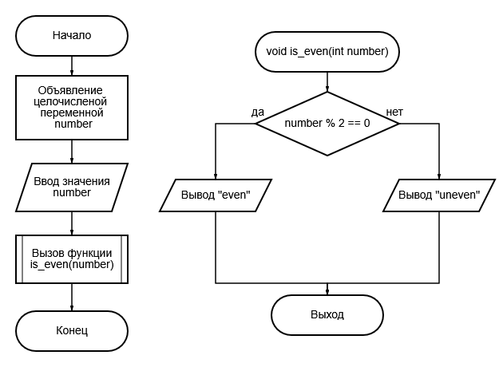

# Задание 1_1_5

## 1. Постановка задачи
Вывести пирамиду из чисел от 1 до N. Допустимая высота от 1 до 9 включительно. Использовать циклы.

### 1.1 Описание входных данных
Целое число N.

### 1.2 Описание выходных данных
Пирамида из натуральных чисел высоты N. Первое число в строке выводиться с первой позиции. Остальные разделены одним пробелом. Если N введено неверно, вывести:  
`N is wrong: «значение N»`

#### Пример вывода
```
1
1 2
1 2 3
1 2 3 4
1 2 3 4 5
```

## 2. Метод решения
*Используемые функции:*
- функция main для определения точки входа программы

*Другие инструменты:*
- библиотека iostream для поддержки ввода/вывода


## 3. Описание алгоритмов

### 3.1 Алгоритм функции main
Имя: main  
Метод/функция: Функция  
Параметры: void  
Возвращаемое значение: int  
Функционал: Определение точки входа программы.  
<table>
    <thead>
        <tr>
            <th>№</th>
            <th>Предикат</th>
            <th>Действия</th>
            <th>№ перехода</th>
        </tr>
    </thead>
    <tbody>
        <tr>
            <td>1</td>
            <td></td>
            <td>Объявление целочисленной переменной N.</td>
            <td>2</td>
        </tr>
        <tr>
            <td>2</td>
            <td></td>
            <td>Ввод значения N.</td>
            <td>3</td>
        </tr>
        <tr>
            <td rowspan="2">3</td>
            <td>N >= 1 и N <= 9</td>
            <td></td>
            <td>4</td>
        </tr>
        <tr>
            <td></td>
            <td>Вывод: "N is wrong: N"</td>
            <td>0</td>
        </tr>
    </tbody>
</table>


## 4. Блок-схемы алгоритмов




## 5. Код программы

### 5.1 Файл main.cpp
```cpp
#include <iostream>

void is_even(int number)
{
    if(number % 2 == 0)
    {
        std::cout << "even";
    }
    else
    {
        std::cout << "uneven";
    }
}

int main()
{
    int number = 0;
    std::cin >> number;
    is_even(number);

    return(0);
}
```


## 6. Тестирование
<table>
    <thead>
        <tr>
            <th>Входные данные</th>
            <th>Ожидаемые выходные данные</th>
            <th>Фактические выходные данные</th>
        </tr>
    </thead>
    <tbody>
        <tr>
            <td>
                <pre>
2
                </pre>
            </td>
            <td>
                <pre>
even
                </pre>
            </td>
            <td>
                <pre>
even
                </pre>
            </td>
        </tr>
        <tr>
            <td>
                <pre>
5
                </pre>
            </td>
            <td>
                <pre>
uneven
                </pre>
            </td>
            <td>
                <pre>
uneven
                </pre>
            </td>
        </tr>
    </tbody>
</table>
