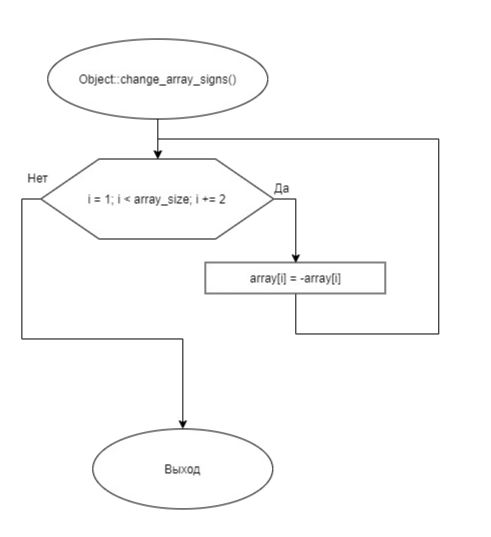

# Задание 3_01_1 | Передача объекта в функцию в качестве параметра

## 1. Постановка задачи
Сконструировать систему, которая демонстрирует особенности при передаче объекта в функцию в качестве параметра. Показывает, какого характера ошибки могут возникнуть при выполнении такой передачи и как их обойти.

**Спроектировать объект (разработать описание класса), который имеет свойства:**
- переменную целого типа в закрытом доступе, содержит количество элементов массива;
- указатель на массив целого типа в открытом доступе.
Функционал объекта:
- параметризованный конструктор, с одним целочисленным параметром. С новой строки выводит сообщение, что работает параметризированный конструктор. Конструктор создает массив целочисленного типа размерности согласно значению параметра. Каждому элементу присваивает значение равное квадрату соответствующего индекса;
- конструктор по умолчанию. Выдает сообщение, что работает конструктор по умолчанию;
- метод, в открытом доступе, который выводит значения элементов массива с новой строки, разделенным тремя пробелами;
- метод, в открытом доступе, который меняет знак каждого второго элемента массива;
- метод, в открытом доступе, который освобождает память, выделенную для массива;
- деструктор, выдает с новой строки сообщение, что работает деструктор.

**Разработать функцию, которой в качестве параметра передается объект спроектированного класса. В описании функции реализовать алгоритм:**
1. Для объекта, переданного в качестве параметра вызов метода, который меняет знак значений части элементов массива.
2. Вызов метода вывода содержимого массива.

**Исходный алгоритм сборки и отработки системы:**
1. Вводит целочисленное, положительное значение, размещает в целочисленной переменной.
2. Объявляет объект с использованием параметризированного конструктора, в качестве аргумента передает целочисленную переменную, которая содержит введенное значение.
3. Вызывает метод вывода значений элементов объявленного объекта.
4. Вызывает функцию, которой в качестве аргумента передает объявленный объект.
5. Вызывает метод вывода значений элементов объявленного объекта.
6. Вызов метода для освобождения памяти для массива.
7. Завершение работы системы.
  
Доработайте конструкцию (не меняя описание класса), алгоритм сборки и отработки системы так, чтобы выводимые значения во второй и пятой строке совпали.

### 1.1 Описание входных данных
Первая строка:  
```«целое число»```  

Пример ввода:  
```5```

### 1.2 Описание выходных данных
Конструктор по умолчанию выводит сообщение:  
```Default constructor```

Параметризированный конструктор выводит сообщение:  
```Parameterized constructor```

Деструктор выводит сообщение:  
```Destructor```

Метод вывода значений элементов массива выводит последовательность чисел:  
```«целое число»   «целое число»   «целое число» ...```

#### Пример вывода
*До доработки системы*
```
Parameterized constructor
0   1   4   9   16
0   -1   4   -9   16
Destructor
0   -1   4   -9   16
Destructor
```
*После доработки системы*
```
Parameterized constructor
0   1   4   9   16
0   -1   4   -9   16
Destructor
0   1   4   9   16
Destructor
```

## 2. Метод решения
*Используемые объекты:*
- объект object класса Object предназначен для демонстрации работы системы

*Используемые функции:*
- функция a для демонстрации передачи объекта в функцию в качестве параметра
- функция main для определения точки входа программы

*Другие инструменты:*
- заголовочный файл
- указатель
- библиотека iostream для поддержки ввода/вывода

**Класс Object:**
- свойства/поля:
  - поле array:
    - описание назначения: указатель на массив целого типа
    - наименование: array
    - тип: int*
    - модификатор доступа: public
  - поле array_size:
    - описание назначения: хранение размера массива
    - наименование: array_size
    - тип: int
    - модификатор доступа: private
- функционал:
  - метод print_array: выводит значения элементов массива с новой строки, разделенные тремя пробелами
  - метод change_array_signs: меняет знак каждого второго элемента массива
  - метод delete_array: освобождает память, выделенную для массива
  - метод Object: стандартный конструктор
  - метод Object: параметризированный конструктор
  - метод ~Object: деструктор

## 3. Описание алгоритмов
Согласно этапам разработки, после определения необходимого инструментария в разделе «Метод», составляются подробные описания алгоритмов для методов классов и функций.

### 3.1 Алгоритм метода print_array класса Object
Метод/функция: Метод  
Класс объекта: Object  
Модификатор доступа: public  
Параметры: void
Возвращаемое значение: void
Функционал: выводит значения элементов массива с новой строки, разделенные тремя пробелами  
<table>
    <thead>
        <tr>
            <th>№</th>
            <th>Предикат</th>
            <th>Действия</th>
            <th>№ перехода</th>
        </tr>
    </thead>
    <tbody>
        <tr>
            <td>1</td>
            <td></td>
            <td>Инициализация целочисленного счётчика i.</td>
            <td>2</td>
        </tr>
        <tr>
            <td rowspan="2">2</td>
            <td>i < array_size</td>
            <td>Вывод значения элемента массива с индексом i.</td>
            <td>3</td>
        </tr>
        <tr>
            <td></td>
            <td></td>
            <td>0</td>
        </tr>
        <tr>
            <td rowspan="2">3</td>
            <td>i == array_size - 1</td>
            <td>Перевод каретки на новую строку.</td>
            <td>0</td>
        </tr>
        <tr>
            <td></td>
            <td></td>
            <td>4</td>
        </tr>
        <tr>
            <td>4</td>
            <td></td>
            <td>Вывод "   " (три пробела).</td>
            <td>5</td>
        </tr>
        <tr>
            <td>5</td>
            <td></td>
            <td>Увеличение значения счётчика i на 1.</td>
            <td>2</td>
        </tr>
    </tbody>
</table>

### 3.2 Алгоритм метода change_array_signs класса Object
Метод/функция: Метод
Класс объекта: Object
Модификатор доступа: public
Параметры: void
Возвращаемое значение: void
Функционал: меняет знак каждого второго элемента массива
<table>
    <thead>
        <tr>
            <th>№</th>
            <th>Предикат</th>
            <th>Действия</th>
            <th>№ перехода</th>
        </tr>
    </thead>
    <tbody>
        <tr>
            <td>1</td>
            <td></td>
            <td>Инициализация целочисленного счётчика i значением 1.</td>
            <td>2</td>
        </tr>
        <tr>
            <td rowspan="2">2</td>
            <td>i < array_size</td>
            <td>Присвоение значения элементу массива с индексом i, противоположного имеющемуся.</td>
            <td>3</td>
        </tr>
        <tr>
            <td></td>
            <td></td>
            <td>0</td>
        </tr>
        <tr>
            <td>3</td>
            <td></td>
            <td>Увеличение значения счётчика i на 2.</td>
            <td>2</td>
        </tr>
    </tbody>
</table>

### 3.3 Алгоритм метода delete_array класса Object
Метод/функция: Метод
Класс объекта: Object
Модификатор доступа: public
Параметры: void
Возвращаемое значение: void
Функционал: освобождает память, выделенную для массива
<table>
    <thead>
        <tr>
            <th>№</th>
            <th>Предикат</th>
            <th>Действия</th>
            <th>№ перехода</th>
        </tr>
    </thead>
    <tbody>
        <tr>
            <td>1</td>
            <td></td>
            <td>Освобождение памяти, выделенной под массив array</td>
            <td>0</td>
        </tr>
    </tbody>
</table>

### 3.4 Алгоритм конструктора класса Object
Метод/функция: Конструктор  
Класс объекта: Object  
Модификатор доступа: public  
Параметры: void  
Функционал: конструктор объекта по умолчанию
<table>
    <thead>
        <tr>
            <th>№</th>
            <th>Предикат</th>
            <th>Действия</th>
            <th>№ перехода</th>
        </tr>
    </thead>
    <tbody>
        <tr>
            <td>1</td>
            <td></td>
            <td>Вывод "Default constructor"</td>
            <td>0</td>
        </tr>
    </tbody>
</table>

### 3.5 Алгоритм конструктора класса Object
Метод/функция: Конструктор  
Класс объекта: Object  
Модификатор доступа: public  
Параметры: int size  
Функционал: Параметризированный конструктор
<table>
    <thead>
        <tr>
            <th>№</th>
            <th>Предикат</th>
            <th>Действия</th>
            <th>№ перехода</th>
        </tr>
    </thead>
    <tbody>
        <tr>
            <td>1</td>
            <td></td>
            <td>Вывод "Parameterized constructor"</td>
            <td>2</td>
        </tr>
        <tr>
            <td>2</td>
            <td></td>
            <td>Присвоение значения size полю array_size</td>
            <td>3</td>
        </tr>
        <tr>
            <td>3</td>
            <td></td>
            <td>Выделение   памяти   для   массива   и   присвоение адреса его первого элемента полю array</td>
            <td>4</td>
        </tr>
        <tr>
            <td>4</td>
            <td></td>
            <td>Инициализация целочисленного счётчика i.</td>
            <td>5</td>
        </tr>
        <tr>
            <td rowspan="2">5</td>
            <td>i < size</td>
            <td>Присвоение элементу массива array с индексом i значения, равного квадрату его индекса.</td>
            <td>6</td>
        </tr>
        <tr>
            <td></td>
            <td></td>
            <td>0</td>
        </tr>
        <tr>
            <td>6</td>
            <td></td>
            <td>Увеличение значения счётчика i на 1.</td>
            <td>5</td>
        </tr>
    </tbody>
</table>

### 3.6 Алгоритм деструктора класса Object
Метод/функция: Деструктор  
Класс объекта: Object  
Модификатор доступа: public  
Параметры: void  
Функционал: Параметризированный конструктор  
<table>
    <thead>
        <tr>
            <th>№</th>
            <th>Предикат</th>
            <th>Действия</th>
            <th>№ перехода</th>
        </tr>
    </thead>
    <tbody>
        <tr>
            <td>1</td>
            <td></td>
            <td>Вывод "Destructor"</td>
            <td>0</td>
        </tr>
    </tbody>
</table>

### 3.7 Алгоритм функции a
Параметры: Object object  
Возвращаемое значение: void  
Функционал: демонстрация передачи объекта в функцию в качестве параметра  
<table>
    <thead>
        <tr>
            <th>№</th>
            <th>Предикат</th>
            <th>Действия</th>
            <th>№ перехода</th>
        </tr>
    </thead>
    <tbody>
        <tr>
            <td>1</td>
            <td></td>
            <td>Вызов метода change_array_signs для объекта object</td>
            <td>2</td>
        </tr>
        <tr>
            <td>2</td>
            <td></td>
            <td>Вызов метода print_array для объекта object</td>
            <td>0</td>
        </tr>
    </tbody>
</table>

### 3.8 Алгоритм функции main
Имя: main  
Параметры: void  
Возвращаемое значение: int  
Функционал: определение точки входа программы  
<table>
    <thead>
        <tr>
            <th>№</th>
            <th>Предикат</th>
            <th>Действия</th>
            <th>№ перехода</th>
        </tr>
    </thead>
    <tbody>
        <tr>
            <td>1</td>
            <td></td>
            <td>Объявление целочисленной переменной size</td>
            <td>2</td>
        </tr>
        <tr>
            <td>2</td>
            <td></td>
            <td>Ввод значения size</td>
            <td>3</td>
        </tr>
        <tr>
            <td>3</td>
            <td></td>
            <td>Объявление объекта object класса Object и вызов его параметризированного конструктора с передачей значения size</td>
            <td>4</td>
        </tr>
        <tr>
            <td>4</td>
            <td></td>
            <td>Вызов метода print_array для объекта object</td>
            <td>5</td>
        </tr>
        <tr>
            <td>5</td>
            <td></td>
            <td>Вызов функции a с передачей объекта object в качестве аргумента</td>
            <td>6</td>
        </tr>
        <tr>
            <td>6</td>
            <td></td>
            <td>Вызов метода change_array_signs для объекта object</td>
            <td>7</td>
        </tr>
        <tr>
            <td>7</td>
            <td></td>
            <td>Вызов метода print_array для объекта object</td>
            <td>8</td>
        </tr>
        <tr>
            <td>8</td>
            <td></td>
            <td>Вызов метода delete_array для объекта object</td>
            <td>0</td>
        </tr>
    </tbody>
</table>


## 4. Блок-схемы алгоритмов





## 5. Код программы

### 5.1 Файл main.cpp
```cpp
#include <iostream>
#include "Object.h"


void a(Object object)
{
    object.change_array_signs();
    object.print_array();
}

int main()
{
    int size;
    std::cin >> size;

    Object object(size);
    object.print_array();
    a(object);
    object.change_array_signs(); // доработка
    object.print_array();
    object.delete_array();
    return(0);
}
```

### 5.2 Файл Object.cpp
```cpp
#include <iostream>
#include "Object.h"


Object::Object()
{
    std::cout << "Default constructor" << std::endl;
}

Object::Object(int size)
{
    std::cout << "Parameterized constructor" << std::endl;

    array_size = size;
    array = new int[size];
    for(int i{0}; i < size; i++)
    {
        array[i] = i * i;
    }
}

Object::~Object()
{
    std::cout << "Destructor" << std::endl;
}

void Object::print_array()
{
    for(int i{0}; i < array_size; i++)
    {
        std::cout << array[i];
        if(i == array_size-1) {std::cout << std::endl; break;}
        std::cout << "   ";
    }
}

void Object::change_array_signs()
{
    for(int i{1}; i < array_size; i += 2)
    {
        array[i] = -array[i];
    }
}

void Object::delete_array()
{
    delete array;
}
```

### 5.3 Файл Object.h
```cpp
#ifndef __OBJECT__H
#define __OBJECT__H


class Object
{
public:
    int* array;

    void print_array();
    void change_array_signs();
    void delete_array();

    Object();
    Object(int size);
    ~Object();

private:
    int array_size;
};


#endif
```

## 6. Тестирование
<table>
    <thead>
        <tr>
            <th>Входные данные</th>
            <th>Ожидаемые выходные данные</th>
            <th>Фактические выходные данные</th>
        </tr>
    </thead>
    <tbody>
        <tr>
            <td>5</td>
            <td>
                <pre>
Parameterized constructor
0   1   4   9   16
0   -1   4   -9   16
Destructor
0   1   4   9   16
Destructor
                </pre>
            </td>
            <td>
                <pre>
Parameterized constructor
0   1   4   9   16
0   -1   4   -9   16
Destructor
0   1   4   9   16
Destructor
                </pre>
            </td>
        </tr>
    </tbody>
</table>
