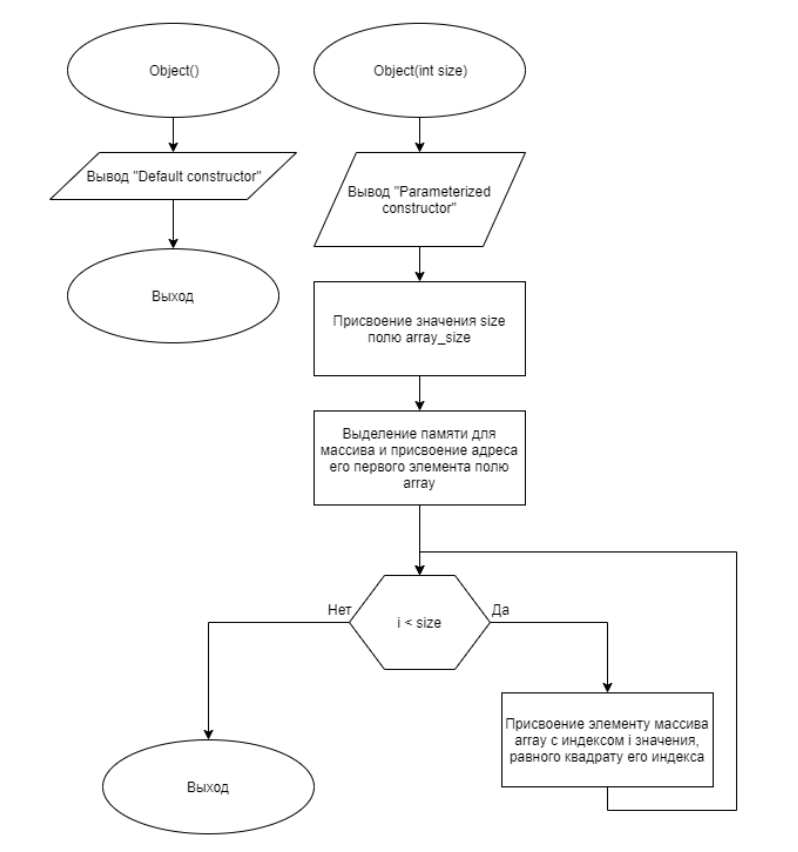
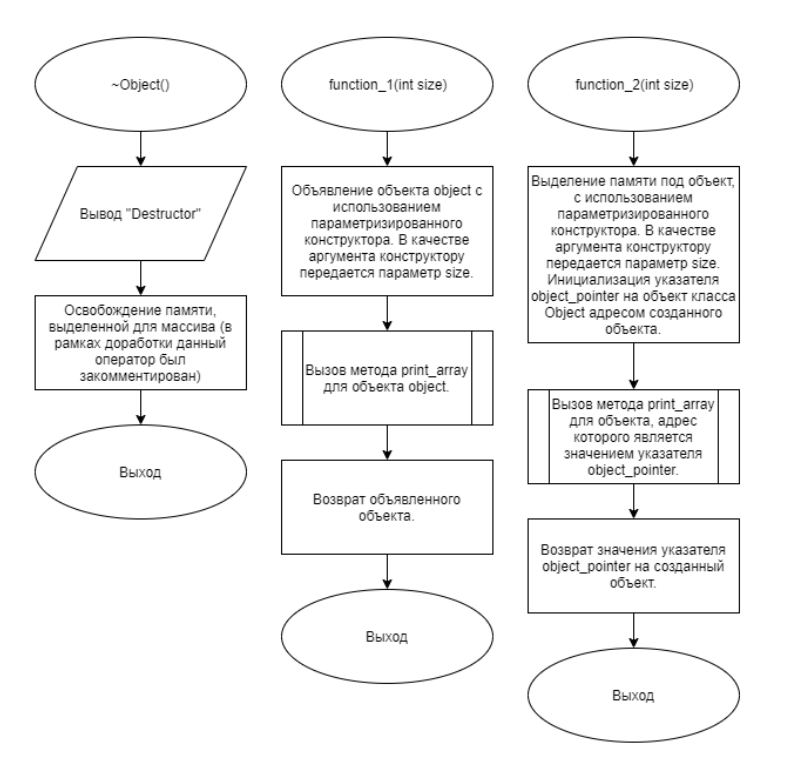
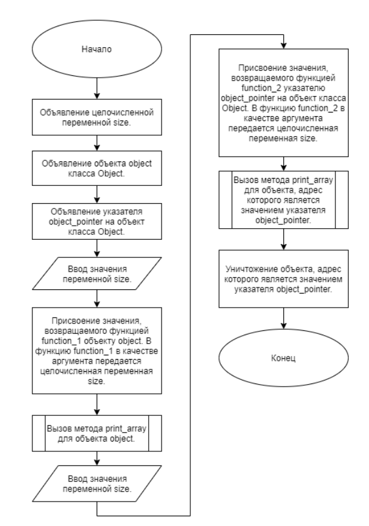

# Задание 3_02_1 | Возврат объекта из функции

## 1. Постановка задачи
Сконструировать систему, которая демонстрирует особенности при возврате объекта из функции. Показывает, какого характера ошибки могут возникнуть при выполнении возврата и как их обойти.

**Спроектировать объект (разработать описание класса), который имеет свойства:**
- переменную целого типа в закрытом доступе, содержит количество элементов массива  
- указатель на массив целого типа в открытом доступе

**Функционал объекта:**
- конструктор по умолчанию. Выдает сообщение, что работает конструктор по умолчанию  
- параметризованный конструктор, с одним целочисленным параметром. С новой строки выводит сообщение, что работает параметризированный конструктор. Конструктор создает массив целочисленного типа размерности согласно значению параметра. Каждому элементу присваивает значение равное квадрату соответствующего индекса  
- метод, в открытом доступе, который выводит значения элементов массива с новой строки, разделенным тремя пробелами;
- деструктор, выдает с новой строки сообщение, что работает деструктор. После этого освобождает память, выделенную для массива.

**Разработать функцию номером 1, c параметром целого типа. Посредством данного параметра передается значение размерности массива. В описании функции реализовать алгоритм:**
1. Объявить объект, использовать параметризированный конструктор. В качестве аргумента конструктору передать параметр функции.
2. Для объекта вызвать метод вывода содержимого массива.
3. Возвратить объявленный объект.

**Разработать функцию номером 2, c параметром целого типа. Посредством данного параметра передается значение размерности массива. В описании функции реализовать алгоритм:**
1. Создать объект, использовать параметризированный конструктор. В качестве аргумента конструктору передать параметр функции. Инициировать указатель на объект заданного класса адресом созданного объекта.
2. Для объекта вызвать метод вывода содержимого массива.
3. Вернуть значение указателя на объект заданного класса.


**Первоначальный алгоритм сборки и отработки системы:**
1. Объявляется целочисленная переменная.
2. Объявляется объект заданного класса.
3. Объявляется указатель на объект заданного класса.
4. Вводится целое, положительное число, его значение размещается в целочисленную переменную.
5. Объявленному объекту присваивается значение, возвращаемое функцией с номером 1. В функцию с номером 1 в качестве аргумента передается целочисленная переменная.
6. Для объявленного объекта вызывается метод вывода содержимого массива.
7. Вводится целочисленное, положительное число, его значение размещается в целочисленную переменную.
8. Объявленному указателю на объект заданного класса присваивается значение, возвращаемое функцией с номером 2. В функцию с номером 2 в качестве аргумента передается целочисленная переменная.
9. Для объекта, адрес которой является значением указателя, вызваться метод вывода содержимого массива.
10. Уничтожается объект, адрес которого является значением указателя.
11. Завершается работа системы со значением кода возврата равного 0.

При такой реализации, работа программы завершиться аварийно или значения третей и пятой строки вывода не совпадут.  
Закомментируйте один оператор так, чтобы программа завершилась нормально и выводимые значения в третей и пятой строке совпали.  
При сдаче задания, надо пояснить, почему первоначально произошла ошибка и почему выполненная коррекция кода исправляет ситуацию.  

### 1.1 Описание входных данных
Первая строка:  
```«целое число»```  

Вторая строка:  
```«целое число»```  

Пример ввода:  
```
5
8
```

### 1.2 Описание выходных данных
Конструктор по умолчанию выводит сообщение:  
```Default constructor```

Параметризированный конструктор выводит сообщение:  
```Parameterized constructor```

Деструктор выводит сообщение:  
```Destructor```

Метод вывода значений элементов массива выводит последовательность чисел:  
```«целое число»   «целое число»   «целое число» ...```

#### Возможный пример вывода до доработки программы-системы:
```
Default constructor
Parameterized constructor
0   1   4   9   16
Destructor
2060656   2031808   4   9   16
Parameterized constructor
0   1   4   9   16   25   36   49
0   1   4   9   16   25   36   49
Destructor
Destructor
```


## 2. Метод решения
*Используемые объекты:*
- объект object класса Object предназначен для демонстрации работы системы

*Используемые функции:*
- функция function_1 для демонстрации возврата объекта из функции в виде объекта
- функция function_2 для демонстрации возврата объекта из функции в виде указателя
- функция main для определения точки входа программы

*Другие инструменты:*
- заголовочный файл
- указатель
- библиотека iostream для поддержки ввода/вывода

**Класс Object:**
- свойства/поля:
  - поле array:
    - описание назначения: указатель на массив целого типа
    - наименование: array
    - тип: int*
    - модификатор доступа: public
  - поле array_size:
    - описание назначения: хранение размера массива
    - наименование: array_size
    - тип: int
    - модификатор доступа: private
- функционал:
  - метод print_array: выводит значения элементов массива с новой строки, разделенные тремя пробелами
  - метод Object: стандартный конструктор
  - метод Object: параметризированный конструктор
  - метод ~Object: деструктор

## 3. Описание алгоритмов

### 3.1 Алгоритм метода print_array класса Object
Метод/функция: Метод  
Класс объекта: Object  
Модификатор доступа: public  
Параметры: void
Возвращаемое значение: void
Функционал: выводит значения элементов массива с новой строки, разделенные тремя пробелами  
<table>
    <thead>
        <tr>
            <th>№</th>
            <th>Предикат</th>
            <th>Действия</th>
            <th>№ перехода</th>
        </tr>
    </thead>
    <tbody>
        <tr>
            <td>1</td>
            <td></td>
            <td>Инициализация целочисленного счётчика i.</td>
            <td>2</td>
        </tr>
        <tr>
            <td rowspan="2">2</td>
            <td>i < array_size</td>
            <td>Вывод значения элемента массива с индексом i.</td>
            <td>3</td>
        </tr>
        <tr>
            <td></td>
            <td></td>
            <td>0</td>
        </tr>
        <tr>
            <td rowspan="2">2</td>
            <td>i == array_size - 1</td>
            <td>Перевод каретки на новую строку.</td>
            <td>0</td>
        </tr>
        <tr>
            <td></td>
            <td></td>
            <td>4</td>
        </tr>
        <tr>
            <td>4</td>
            <td></td>
            <td>Вывод "   " (три пробела).</td>
            <td>5</td>
        </tr>
            <td>5</td>
            <td></td>
            <td>Увеличение значения счётчика i на 1.</td>
            <td>2</td>
    </tbody>
</table>

### 3.2 Алгоритм конструктора класса Object
Метод/функция: Конструктор  
Класс объекта: Object  
Модификатор доступа: public  
Параметры: void  
Функционал: конструктор объекта по умолчанию
<table>
    <thead>
        <tr>
            <th>№</th>
            <th>Предикат</th>
            <th>Действия</th>
            <th>№ перехода</th>
        </tr>
    </thead>
    <tbody>
        <tr>
            <td>1</td>
            <td></td>
            <td>Вывод "Default constructor"</td>
            <td>0</td>
        </tr>
    </tbody>
</table>

### 3.3 Алгоритм конструктора класса Object
Метод/функция: Конструктор  
Класс объекта: Object  
Модификатор доступа: public  
Параметры: int size  
Функционал: Параметризированный конструктор
<table>
    <thead>
        <tr>
            <th>№</th>
            <th>Предикат</th>
            <th>Действия</th>
            <th>№ перехода</th>
        </tr>
    </thead>
    <tbody>
        <tr>
            <td>1</td>
            <td></td>
            <td>Вывод "Parameterized constructor"</td>
            <td>2</td>
        </tr>
        <tr>
            <td>2</td>
            <td></td>
            <td>Присвоение значения size полю array_size</td>
            <td>3</td>
        </tr>
        <tr>
            <td>3</td>
            <td></td>
            <td>Выделение   памяти   для   массива   и   присвоение адреса его первого элемента полю array</td>
            <td>4</td>
        </tr>
        <tr>
            <td>4</td>
            <td></td>
            <td>Инициализация целочисленного счётчика i.</td>
            <td>5</td>
        </tr>
        <tr>
            <td rowspan="2">5</td>
            <td>i < size</td>
            <td>Присвоение элементу массива array с индексом i значения, равного квадрату его индекса.</td>
            <td>6</td>
        </tr>
        <tr>
            <td></td>
            <td></td>
            <td>0</td>
        </tr>
        <tr>
            <td>6</td>
            <td></td>
            <td>Увеличение значения счётчика i на 1.</td>
            <td>5</td>
        </tr>
    </tbody>
</table>

### 3.4 Алгоритм деструктора класса Object
Метод/функция: Деструктор  
Класс объекта: Object  
Модификатор доступа: public  
Параметры: void  
Функционал: Параметризированный конструктор  
<table>
    <thead>
        <tr>
            <th>№</th>
            <th>Предикат</th>
            <th>Действия</th>
            <th>№ перехода</th>
        </tr>
    </thead>
    <tbody>
        <tr>
            <td>1</td>
            <td></td>
            <td>Вывод "Destructor"</td>
            <td>2</td>
        </tr>
        <tr>
            <td>2</td>
            <td></td>
            <td>Освобождение памяти, выделенной для массива (в рамках доработки данный оператор был закомментирован)</td>
            <td>0</td>
        </tr>
    </tbody>
</table>

### 3.5 Алгоритм функции function_1
Параметры: int size  
Возвращаемое значение: Object  
Функционал: демонстрация возврата объекта из функции в виде объекта  
<table>
    <thead>
        <tr>
            <th>№</th>
            <th>Предикат</th>
            <th>Действия</th>
            <th>№ перехода</th>
        </tr>
    </thead>
    <tbody>
        <tr>
            <td>1</td>
            <td></td>
            <td>Объявление объекта object с использованием параметризированного конструктора. В качестве аргумента конструктору передается параметр size.</td>
            <td>2</td>
        </tr>
        <tr>
            <td>2</td>
            <td></td>
            <td>Вызов метода print_array для объекта object.</td>
            <td>3</td>
        </tr>
        <tr>
            <td>3</td>
            <td></td>
            <td>Возврат объявленного объекта.</td>
            <td>0</td>
        </tr>
    </tbody>
</table>

### 3.6 Алгоритм функции function_2
Параметры: int size  
Возвращаемое значение: Object  
Функционал: демонстрация возврата объекта из функции в виде указателя  
<table>
    <thead>
        <tr>
            <th>№</th>
            <th>Предикат</th>
            <th>Действия</th>
            <th>№ перехода</th>
        </tr>
    </thead>
    <tbody>
        <tr>
            <td>1</td>
            <td></td>
            <td>Выделение памяти под объект, с использованием параметризированного конструктора. В качестве аргумента конструктору передается параметр size. Инициализация указателя object_pointer на объект класса Object адресом созданного объекта.</td>
            <td>2</td>
        </tr>
        <tr>
            <td>2</td>
            <td></td>
            <td>Вызов метода print_array для объекта, адрес которого является значением указателя object_pointer.</td>
            <td>3</td>
        </tr>
        <tr>
            <td>3</td>
            <td></td>
            <td>Возврат значения указателя object_pointer на созданный объект.</td>
            <td>0</td>
        </tr>
    </tbody>
</table>

### 3.7 Алгоритм функции main
Имя: main  
Параметры: void  
Возвращаемое значение: int  
Функционал: определение точки входа программы  
<table>
    <thead>
        <tr>
            <th>№</th>
            <th>Предикат</th>
            <th>Действия</th>
            <th>№ перехода</th>
        </tr>
    </thead>
    <tbody>
        <tr>
            <td>1</td>
            <td></td>
            <td>Объявление целочисленной переменной size.</td>
            <td>2</td>
        </tr>
        <tr>
            <td>2</td>
            <td></td>
            <td>Объявление объекта object класса Object.</td>
            <td>3</td>
        </tr>
        <tr>
            <td>3</td>
            <td></td>
            <td>Объявление указателя object_pointer на объект класса Object.</td>
            <td>4</td>
        </tr>
        <tr>
            <td>4</td>
            <td></td>
            <td>Ввод значения переменной size.</td>
            <td>5</td>
        </tr>
        <tr>
            <td>5</td>
            <td></td>
            <td>Присвоение значения, возвращаемого функцией function_1 объекту object. В функцию function_1 в качестве аргумента передается целочисленная переменная size.</td>
            <td>6</td>
        </tr>
        <tr>
            <td>6</td>
            <td></td>
            <td>Вызов метода print_array для объекта object.</td>
            <td>7</td>
        </tr>
        <tr>
            <td>7</td>
            <td></td>
            <td>Ввод значения переменной size.</td>
            <td>8</td>
        </tr>
        <tr>
            <td>8</td>
            <td></td>
            <td>Присвоение значения, возвращаемого функцией function_2 указателю object_pointer на объект класса Object. В функцию function_2 в качестве аргумента передается целочисленная переменная size.</td>
            <td>9</td>
        </tr>
        <tr>
            <td>9</td>
            <td></td>
            <td>Вызов метода print_array для объекта, адрес которого является значением указателя object_pointer.</td>
            <td>10</td>
        </tr>
        <tr>
            <td>10</td>
            <td></td>
            <td>Уничтожение объекта, адрес которого является значением указателя object_pointer.</td>
            <td>0</td>
        </tr>
    </tbody>
</table>


## 4. Блок-схемы алгоритмов






## 5. Код программы

### 5.1 Файл Object.h
```cpp
#ifndef __OBJECT__H
#define __OBJECT__H


class Object
{
public:
    int* array;
    void print_array();
    
    Object();
    Object(int size);
    ~Object();
private:
    int array_size;
};


#endif
```

### 5.2 Файл Object.cpp
```cpp
#include "Object.h"
#include <iostream>


Object::Object()
{
	std::cout << "Default constructor" << std::endl;
}

Object::Object(int size)
{
	std::cout << "Parameterized constructor" << std::endl;
	
	array_size = size;
	array = new int[size];
	for(int i = 0; i < size; i++)
	{
		array[i] = i * i;
	}
}

Object::~Object()
{
	std::cout << "Destructor" << std::endl;
	
    /* доработка по заданию: */
	//delete array;
}

void Object::print_array()
{
	for(int i = 0; i < array_size; i++)
	{
		std::cout << array[i];
		if(i == array_size - 1) {std::cout << std::endl; break;}
		std::cout << "   ";
	}
}
```

### 5.3 Файл main.cpp
```cpp
#include <iostream>
#include "Object.h"


Object function_1(int size)
{
	Object object(size);
	object.print_array();
	return object;
}

Object* function_2(int size)
{
	Object* object_pointer = new Object(size);
	object_pointer->print_array();
	return object_pointer;
}

int main()
{
	int size = 0;
	Object object;
	Object* object_pointer;
	
	std::cin >> size;
	object = function_1(size);
	object.print_array();
	
	std::cin >> size;
	object_pointer = function_2(size);
	object_pointer->print_array();
	
	delete object_pointer;
	
	return(0);
}
```

## 6. Тестирование
<table>
    <thead>
        <tr>
            <th>Входные данные</th>
            <th>Ожидаемые выходные данные</th>
            <th>Фактические выходные данные</th>
        </tr>
    </thead>
    <tbody>
        <tr>
            <td>8</td>
            <td>
                <pre>
Default constructor
Parameterized constructor
0   1   4   9   16   25   36   49
Destructor
0   1   4   9   16   25   36   49
Parameterized constructor
0   1   4   9   16   25   36   49
0   1   4   9   16   25   36   49
Destructor
Destructor
                </pre>
            </td>
            <td>
                <pre>
Default constructor
Parameterized constructor
0   1   4   9   16   25   36   49
Destructor
0   1   4   9   16   25   36   49
Parameterized constructor
0   1   4   9   16   25   36   49
0   1   4   9   16   25   36   49
Destructor
Destructor
                </pre>
            </td>
        </tr>
    </tbody>
</table>