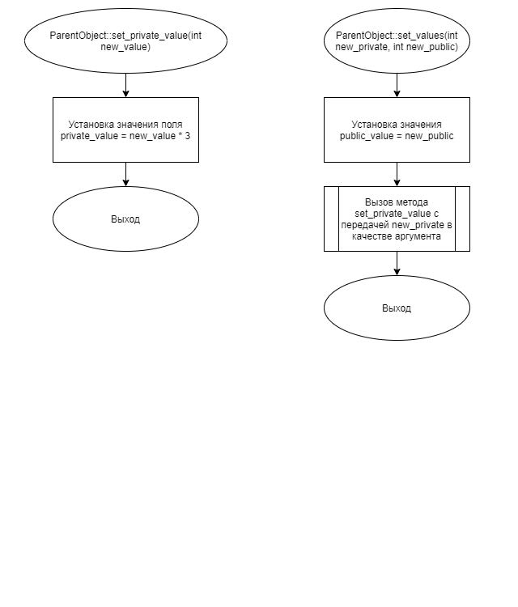
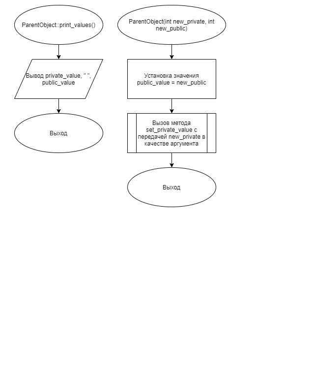
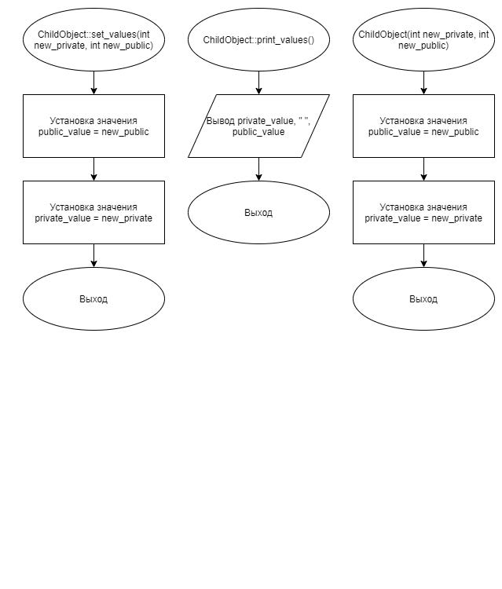
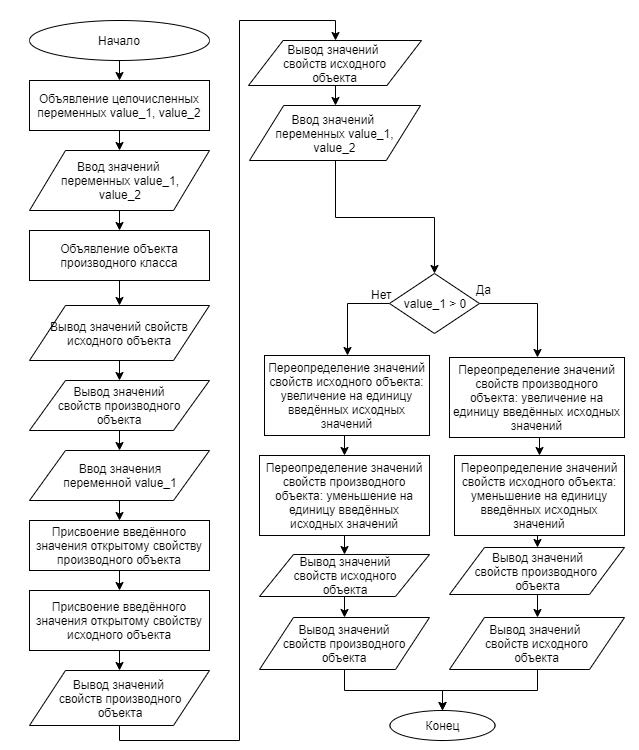

# Задание 3_03_1 | Реализация наследования

## 1. Постановка задачи
Разработать систему, которая 1) демонстрирует возможность конструирования производного объекта на базе исходного объекта; 2) выполняет перераспределение прав доступа к элементам исходного объекта; 3) демонстрирует механизм однозначного обращения (использования, доступа) к элементам производного и исходного объекта.

Спроектировать исходный объект (разработать описание класса), который имеет элементы:

*В закрытом доступе:*
- одно свойство целого типа
- метод, с одним целочисленным параметром, который меняет значение свойства в закрытом доступе на утроенное значение параметра

*В открытом доступе:*
- одно свойство целого типа;
- параметризированный конструктор, с двумя целочисленными параметрами, который устанавливает значения свойств с закрытым и открытым доступом. Значение закрытого свойства меняется посредством вызова метода из закрытого раздела;
- метод с двумя целочисленными параметрами, который устанавливает значения свойств с закрытым и открытым доступом. Значение закрытого свойства меняется посредством вызова метода из закрытого доступа;
- метод, который выводит на экран значение обоих свойств. Сперва значение закрытого свойства, потом значение открытого свойства.

Спроектировать производный объект (разработать описание класса производного объекта), который содержит исходный объект и имеет элементы:

*В закрытом доступе:*

- одно свойство целого типа, наименование которого совпадает с наименование закрытого свойства исходного объекта

*В открытом доступе:*
- одно свойство целого типа, наименование которого совпадает с наименование открытого свойства исходного объекта;
параметризированный конструктор, с двумя целочисленными параметрами, который устанавливает значения свойств с закрытым и открытым доступом;
- метод с двумя целочисленными параметрами, который устанавливает значения свойств с закрытым и открытым доступом. Наименование метода совпадает с наименованием аналогичного метода исходного объекта;
- метод, который выводит на экран значение обоих свойств. Сперва значение свойства закрытым доступом, потом значение свойства открытым доступом. Наименование метода совпадает с наименованием аналогичного метода исходного объекта.

Производный объект спроектировать таким образом, чтобы к открытым элементам исходного объекта сохранить открытый доступ.

Алгоритм конструирования и отработки системы:
1. Добавление в состав системы двух целочисленных переменных.
2. Ввод значений двух целочисленных переменных.
3. Объявление объекта производного класса. При этом обеспечивается отработка параметризированного конструктора для исходного объекта и для производного. В качестве аргументов используются целочисленные переменные, в последовательности, как им были присвоены значения. Первый аргумент содержит значение для закрытого свойства, второй - для открытого свойства.
4. Вывод значений свойств исходного объекта.
5. Вывод значений свойств производного объекта.
6. Ввод значения одной целочисленной переменной.
7. Присвоение введенного значения открытому свойству производного объекта.
8. Присвоение введенного значения открытому свойству исходного объекта.
9. Вывод значений свойств производного  объекта.
10. Вывод значений свойств родительского объекта
11. Ввод значений двух целочисленных переменных.
12. Если значение первой переменной больше нуля, то:
     12.1. Переопределение значений свойств производного объекта - увеличение на единицу введенных исходных значений.
     12.2. Переопределение значений свойств исходного объекта - уменьшение на единицу введенных исходных значений.
     12.3. Вывод значений свойств производного объекта.
     12.4. Вывод значений свойств родительского объекта.
13. Иначе:
     13.1. Переопределение значений свойств родительского объекта - увеличение на единицу введенных исходных значений.
     13.2. Переопределение значений свойств производного объекта - уменьшение на единицу введенных исходных значений.
     13.3. Вывод значений свойств родительского объекта.
     13.4. Вывод значений свойств производного объекта.
14. Завершение работы системы.

### 1.1 Описание входных данных
В первой строке:  
```«целое число» «целое число»```  
Во второй строке:  
```«целое число»```  
В третьей строке:  
```«целое число» «целое число»```  

#### Пример ввода:  
```
8 5
11
-7 12
```

### 1.2 Описание выходных данных
Начиная с первой строки:  
```
«Целое число»    «Целое число»
«Целое число»    «Целое число»
«Целое число»    «Целое число»
«Целое число»    «Целое число»
«Целое число»    «Целое число»
«Целое число»    «Целое число»
```

#### Пример вывода
```
24    5
8    5
8    11
24    11
-18    13
-8    11
```


## 2. Метод решения
*Используемые объекты:*
- объект object класса ChildObject предназначен для демонстрации
реализации наследования

*Используемые функции:*
- функция main для определения точки входа программы

*Другие инструменты:*
- заголовочный файл
- библиотека iostream для поддержки ввода/вывода

**Класс ParentObject:**
- свойства/поля:
  - поле public_value:
    - описание назначения: хранение целочисленного значения
    - наименование: public_value
    - тип: int
    - модификатор доступа: public
  - поле private_value:
    - описание назначения: хранение целочисленного значения
    - наименование: private_value
    - тип: int
    - модификатор доступа: private
- функционал:
  - метод set_private_value: меняет значение свойства в закрытом доступе на утроенное значение параметра
  - метод set_values: устанавливает значения свойств с закрытым и открытым доступом
  - метод print_values: выводит на экран значение обоих свойств
  - метод ParentObject: параметризированный конструктор

**Класс ChildObject:**
- базовые классы:
  - public ParentObject
- свойства/поля:
  - поле public_value:
    - описание назначения: хранение целочисленного значения
    - наименование: public_value
    - тип: int
    - модификатор доступа: public
  - поле private_value:
    - описание назначения: хранение целочисленного значения
    - наименование: private_value
    - тип: int
    - модификатор доступа: private
- функционал:
  - метод set_values: устанавливает значения свойств с закрытым и открытым доступом
  - метод print_values: выводит на экран значение обоих свойств
  - метод ChildObject: параметризированный конструктор

## 3. Описание алгоритмов
Согласно этапам разработки, после определения необходимого инструментария в разделе «Метод», составляются подробные описания алгоритмов для методов классов и функций.

### 3.1 Алгоритм метода set_private_value класса ParentObject
Метод/функция: Метод  
Класс объекта: ParentObject  
Модификатор доступа: private  
Параметры: int value  
Возвращаемое значение: void  
Функционал: меняет значение свойства в закрытом доступе на утроенное значение параметра  
<table>
    <thead>
        <tr>
            <th>№</th>
            <th>Предикат</th>
            <th>Действия</th>
            <th>№ перехода</th>
        </tr>
    </thead>
    <tbody>
        <tr>
            <td>1</td>
            <td></td>
            <td>Присвоение утроенного значения new_value свойству private_value.</td>
            <td>0</td>
        </tr>
    </tbody>
</table>

### 3.2 Алгоритм метода set_values класса ParentObject
Метод/функция: Метод  
Класс объекта: ParentObject  
Модификатор доступа: public  
Параметры: int new_private, int new_public  
Возвращаемое значение: void  
Функционал: устанавливает значения свойств с закрытым и открытым доступом.  
<table>
    <thead>
        <tr>
            <th>№</th>
            <th>Предикат</th>
            <th>Действия</th>
            <th>№ перехода</th>
        </tr>
    </thead>
    <tbody>
        <tr>
            <td>1</td>
            <td></td>
            <td>Присвоение значения параметра new_public свойству public_value.</td>
            <td>2</td>
        </tr>
        <tr>
            <td>2</td>
            <td></td>
            <td>Вызов метода set_private_value с передачей параметра new_private в качестве аргумента.</td>
            <td>0</td>
        </tr>
    </tbody>
</table>

### 3.3 Алгоритм метода print_values класса ParentObject
Метод/функция: Метод  
Класс объекта: ParentObject  
Модификатор доступа: public  
Параметры: void  
Возвращаемое значение: void  
Функционал: выводит на экран значения обоих свойств.  
<table>
    <thead>
        <tr>
            <th>№</th>
            <th>Предикат</th>
            <th>Действия</th>
            <th>№ перехода</th>
        </tr>
    </thead>
    <tbody>
        <tr>
            <td>1</td>
            <td></td>
            <td>Вывод private_value, "   ", public_value</td>
            <td>0</td>
        </tr>
    </tbody>
</table>

### 3.4 Алгоритм конструктора класса ParentObject
Метод/функция: Конструктор  
Класс объекта: ParentObject  
Модификатор доступа: public  
Параметры: int new_private, int new_public  
Функционал: параметризированный конструктор  
<table>
    <thead>
        <tr>
            <th>№</th>
            <th>Предикат</th>
            <th>Действия</th>
            <th>№ перехода</th>
        </tr>
    </thead>
    <tbody>
        <tr>
            <td>1</td>
            <td></td>
            <td>Присвоение значения параметра new_public свойству public_value.</td>
            <td>2</td>
        </tr>
        <tr>
            <td>2</td>
            <td></td>
            <td>Вызов метода set_private_value с передачей параметра new_private в качестве аргумента.</td>
            <td>0</td>
        </tr>
    </tbody>
</table>

### 3.5 Алгоритм метода set_values класса ChildObject
Метод/функция: Метод  
Класс объекта: ChildObject  
Модификатор доступа: public  
Параметры: int new_private, int new_public  
Возвращаемое значение: void  
Функционал: устанавливает значения свойств с закрытым и открытым доступом.  
<table>
    <thead>
        <tr>
            <th>№</th>
            <th>Предикат</th>
            <th>Действия</th>
            <th>№ перехода</th>
        </tr>
    </thead>
    <tbody>
        <tr>
            <td>1</td>
            <td></td>
            <td>Присвоение значения параметра new_public свойству public_value.</td>
            <td>2</td>
        </tr>
        <tr>
            <td>2</td>
            <td></td>
            <td>Присвоение значения параметра new_private свойству private_value.</td>
            <td>0</td>
        </tr>
    </tbody>
</table>

### 3.6 Алгоритм метода print_values класса ChildObject
Метод/функция: Метод  
Класс объекта: ChildObject  
Модификатор доступа: public  
Параметры: void  
Возвращаемое значение: void  
Функционал: выводит на экран значения обоих свойств.  
<table>
    <thead>
        <tr>
            <th>№</th>
            <th>Предикат</th>
            <th>Действия</th>
            <th>№ перехода</th>
        </tr>
    </thead>
    <tbody>
        <tr>
            <td>1</td>
            <td></td>
            <td>Вывод private_value, "   ", public_value</td>
            <td>0</td>
        </tr>
    </tbody>
</table>

### 3.7 Алгоритм конструктора класса ChildObject
Метод/функция: Конструктор  
Класс объекта: ChildObject  
Модификатор доступа: public  
Параметры: int new_private, int new_public  
Функционал: параметризированный конструктор  
<table>
    <thead>
        <tr>
            <th>№</th>
            <th>Предикат</th>
            <th>Действия</th>
            <th>№ перехода</th>
        </tr>
    </thead>
    <tbody>
        <tr>
            <td>1</td>
            <td></td>
            <td>Присвоение значения параметра new_public свойству public_value.</td>
            <td>2</td>
        </tr>
        <tr>
            <td>2</td>
            <td></td>
            <td>Присвоение значения параметра new_private свойству private_value.</td>
            <td>0</td>
        </tr>
    </tbody>
</table>

### 3.8 Алгоритм функции main
Имя: main  
Параметры: void  
Возвращаемое значение: int  
Функционал: определение точки входа программы  
<table>
    <thead>
        <tr>
            <th>№</th>
            <th>Предикат</th>
            <th>Действия</th>
            <th>№ перехода</th>
        </tr>
    </thead>
    <tbody>
        <tr>
            <td>1</td>
            <td></td>
            <td>Объявление целочисленных переменных value_1, value_2.</td>
            <td>2</td>
        </tr>
        <tr>
            <td>2</td>
            <td></td>
            <td>Ввод значений переменных value_1, value_2.</td>
            <td>3</td>
        </tr>
        <tr>
            <td>3</td>
            <td></td>
            <td>Объявление объекта производного класса.</td>
            <td>4</td>
        </tr>
        <tr>
            <td>4</td>
            <td></td>
            <td>Вывод значений свойств исходного объекта.</td>
            <td>5</td>
        </tr>
        <tr>
            <td>5</td>
            <td></td>
            <td>Вывод значений свойств производного объекта.</td>
            <td>6</td>
        </tr>
        <tr>
            <td>6</td>
            <td></td>
            <td>Ввод значения переменной value_1.</td>
            <td>7</td>
        </tr>
        <tr>
            <td>7</td>
            <td></td>
            <td>Присвоение введённого значения открытому свойству производного объекта</td>
            <td>8</td>
        </tr>
        <tr>
            <td>8</td>
            <td></td>
            <td>Присвоение введённого значения открытому свойству исходного объекта.</td>
            <td>9</td>
        </tr>
        <tr>
            <td>9</td>
            <td></td>
            <td>Вывод значений свойств производного объекта.</td>
            <td>10</td>
        </tr>
        <tr>
            <td>10</td>
            <td></td>
            <td>Вывод значений свойств исходного объекта.</td>
            <td>11</td>
        </tr>
        <tr>
            <td>11</td>
            <td></td>
            <td>Ввод значений переменных value_1, value_2.</td>
            <td>12</td>
        </tr>
        <tr>
            <td rowspan="2">12</td>
            <td>Значение value_1 больше нуля</td>
            <td>Переопределение значений свойств производного объекта: увеличение на единицу введённых исходных значений.</td>
            <td>13</td>
        </tr>
        <tr>
            <td></td>
            <td></td>
            <td>16</td>
        </tr>
        <tr>
            <td>13</td>
            <td>Значение value_1 больше нуля</td>
            <td>Переопределение значений свойств исходного объекта: уменьшение на единицу введённых исходных значений.</td>
            <td>14</td>
        </tr>
        <tr>
            <td>14</td>
            <td></td>
            <td>Вывод значений свойств производного объекта.</td>
            <td>15</td>
        </tr>
        <tr>
            <td>15</td>
            <td></td>
            <td>Вывод значений свойств исходного объекта.</td>
            <td>0</td>
        </tr>
        <tr>
            <td>16</td>
            <td>Значение value_1 больше нуля</td>
            <td>Переопределение значений свойств исходного объекта: увеличение на единицу введённых исходных значений.</td>
            <td>17</td>
        </tr>
        <tr>
            <td>17</td>
            <td>Значение value_1 больше нуля</td>
            <td>Переопределение значений свойств производного объекта: уменьшение на единицу введённых исходных значений.</td>
            <td>18</td>
        </tr>
        <tr>
            <td>18</td>
            <td></td>
            <td>Вывод значений свойств исходного объекта.</td>
            <td>19</td>
        </tr>
        <tr>
            <td>19</td>
            <td></td>
            <td>Вывод значений свойств производного объекта.</td>
            <td>0</td>
        </tr>
    </tbody>
</table>


## 4. Блок-схемы алгоритмов






## 5. Код программы

### 5.1 Файл ParentObject.h
```cpp
#ifndef __PARENTOBJECT__H
#define __PARENTOBJECT__H


class ParentObject
{
public:
	int public_value;
	
	void set_values(int new_private, int new_public);
	void print_values();
	
	ParentObject(int new_private, int new_public);

private:
	int private_value;
	
	void set_private_value(int new_value);
};


#endif
```

### 5.2 Файл ParentObject.cpp
```cpp
#include "ParentObject.h"
#include <iostream>


void ParentObject::set_private_value(int new_value)
{
	private_value = new_value * 3;
}

void ParentObject::set_values(int new_private, int new_public)
{
	public_value = new_public;
	set_private_value(new_private);
}

void ParentObject::print_values()
{
	std::cout << private_value << "    " << public_value << std::endl;
}

ParentObject::ParentObject(int new_private, int new_public)
{
	public_value = new_public;
	set_private_value(new_private);
}
```

### 5.3 Файл ChildObject.h
```cpp
#ifndef __CHILDOBJECT__H
#define __CHILDOBJECT__H
#include "ParentObject.h"


class ChildObject : public ParentObject
{
public:
	int public_value;
	
	void set_values(int new_private, int new_public);
	void print_values();
	
	ChildObject(int new_private, int new_public);

private:
	int private_value;
};


#endif
```

### 5.4 Файл ChildObject.cpp
```cpp
#include "ChildObject.h"
#include <iostream>


void ChildObject::set_values(int new_private, int new_public)
{
	public_value = new_public;
	private_value = new_private;
}

void ChildObject::print_values()
{
	std::cout << private_value << "    " << public_value << std::endl;
}

ChildObject::ChildObject(int new_private, int new_public) : ParentObject(new_private, new_public)
{
	public_value = new_public;
	private_value = new_private;
}
```

### 5.5 Файл main.cpp
```cpp
#include <iostream>
#include "ParentObject.h"
#include "ChildObject.h"


int main()
{
	int value_1, value_2;
	std::cin >> value_1 >> value_2;
	
	ChildObject object(value_1, value_2);
	
	object.ParentObject::print_values();
	object.ChildObject::print_values();
	
	std::cin >> value_1;
	object.ChildObject::public_value = value_1;
	object.ParentObject::public_value = value_1;
	
	object.ChildObject::print_values();
	object.ParentObject::print_values();
	
	std::cin >> value_1 >> value_2;
	
	if(value_1 > 0)
	{
		object.ChildObject::set_values(value_1+1, value_2+1);
		object.ParentObject::set_values(value_1-1, value_2-1);
		object.ChildObject::print_values();
		object.ParentObject::print_values();
	}
	else
	{
		object.ParentObject::set_values(value_1+1, value_2+1);
		object.ChildObject::set_values(value_1-1, value_2-1);
		object.ParentObject::print_values();
		object.ChildObject::print_values(); 
	}
	
	return(0);
}
```


## 6. Тестирование
<table>
    <thead>
        <tr>
            <th>Входные данные</th>
            <th>Ожидаемые выходные данные</th>
            <th>Фактические выходные данные</th>
        </tr>
    </thead>
    <tbody>
        <tr>
            <td>
                <pre>
8 5
11
-7 12
                </pre>
            </td>
            <td>
                <pre>
24    5
8    5
8    11
24    11
-18    13
-8    11
                </pre>
            </td>
            <td>
                <pre>
24    5
8    5
8    11
24    11
-18    13
-8    11
                </pre>
            </td>
        </tr>
    </tbody>
</table>