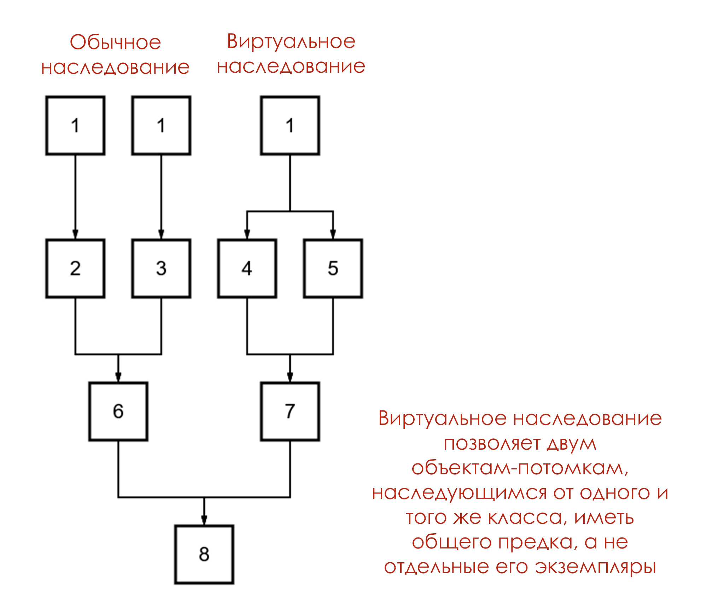
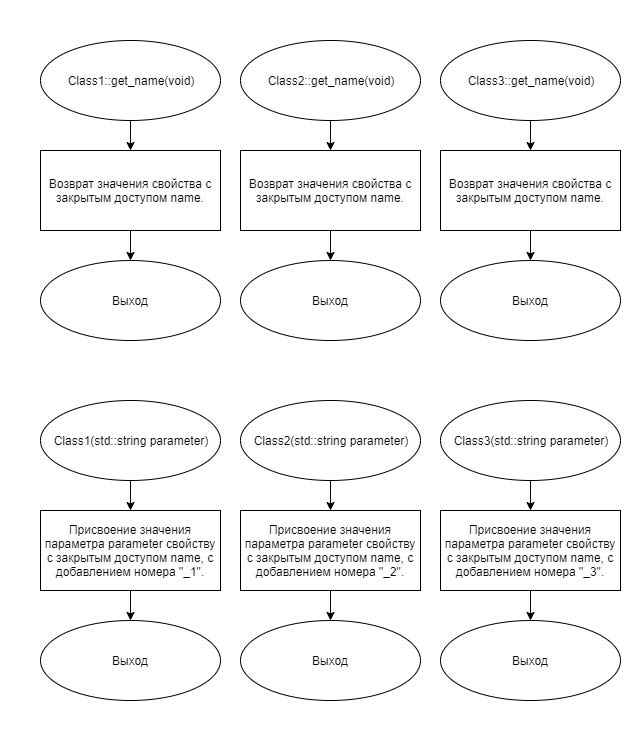
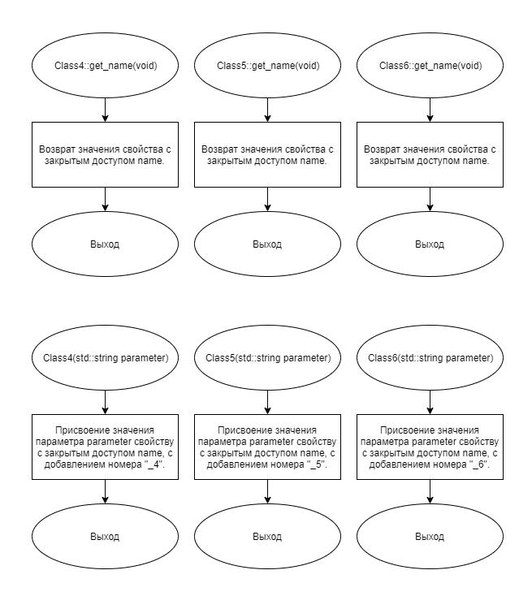
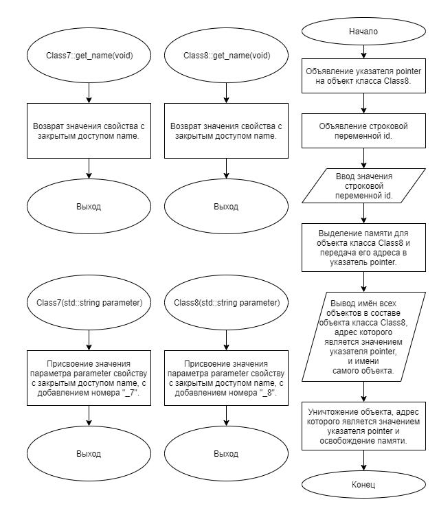

# Задание 3_04_1 | Множественное наследование. Виртуальное наследование

## 1. Постановка задачи
Разработать систему, которая демонстрирует возможность:
- конструирования производного объекта на базе нескольких поколений родительских объектов
- переконфигурации расположения родительских объектов на определенном уровне иерархии
- однозначного обращения (использования, доступа) к элементам производного и исходных объектов

Спроектировать 8 разных объектов. Перенумеровать классы их принадлежности от 1 до 8. Каждый объект имеет свойство строкового типа в закрытом доступе. Это свойство хранит наименование объекта. Наименование объекта определяется в момент создания объекта посредством значения параметра строкового типа конструктора и номера принадлежности классу согласно шаблону:  
`«значение строкового параметра»_«номер класса»`  

У каждого объекта есть метод в открытом доступе, с одинаковым наименованием, который возвращает наименование объекта.

Объекты 2, 3, 4 и 5 классов являются производными (содержат в своем составе) объект первого класса. Объект шестого класса содержит в своем составе объекты второго и третьего класса. Объект седьмого класса содержит в своем составе объекты четвертого и пятого класса. Объект восьмого класса содержит в своем составе объекты шестого и седьмого класса.

При создании объекта со второй по восьмой класс, до вызова их параметризированного конструктора, вызвать параметризированный конструктор или конструкторы входящих (родительских) объектов. При вызове в конструктор родительского объекта в качестве параметра передать выражение:  
`«параметр производного объекта + «_» + «номер производного класса»`  

Например, для конструктора объекта второго класса:  
`cl_2 :: cl_2 ( string s_name ) : cl_1 ( s_name + "_2" )`  

Алгоритм конструирования и отработки системы:
1. Объявляется один указатель на объект класса x.
2. Объявляется переменная строкового типа.
3. Вводится значение строковой переменной. Введенное значение является идентификатором.
4. Создается объект класса 8 посредством параметризированного конструктора, в качестве аргумента передается строковая переменная.
5. Адрес созданного объекта присваивается указателю на объект класса x.
6. Используя только указатель на объект класса x выводится имена всех объектов в составе объекта класса 8 и имя самого объекта класса 8. Вывод выполнить построчно, упорядоченная согласно возрастанию номеров классов. Наименования объектов первого класса выводится последовательно для производных объектов 2, 3. 4 и 5 класса.

Конструктивно выполнить построение так, чтобы всего объектов было 10. При сдаче задачи посредством вложенных прямоугольников нарисовать конструкцию объекта 8 класса и дать пояснения.

### 1.1 Описание входных данных
**Первая строка:**  
`«идентификатор»`

**Пример ввода:**  
`Object`

### 1.2 Описание выходных данных
**Построчно (одиннадцать строк):**  
`«наименование объекта»`  

**Пример вывода:**  
```
Object_8_6_2_1
Object_8_6_3_1
Object_8_1
Object_8_1
Object_8_6_2
Object_8_6_3
Object_8_7_4
Object_8_7_5
Object_8_6
Object_8_7
Object_8
```  

### Небольшое теоретическое пояснение к заданию (прим. редакции)
На схеме представлена структура отношений объектов в составе производного класса, который получится по итогам выполнения задания. По условию в его составе требуется 10 объектов, поэтому виртуальное наследование применено лишь для одной из пар потомков.




## 2. Метод решения
*Используемые объекты:*
- объект pointer класса Class8 предназначен для демонстрации работы множественного наследования

*Используемые функции:*
- функция main для определения точки входа программы

*Другие инструменты:*
- библиотека iostream для поддержки ввода\вывода
- указатель
- заголовочный файл

**Класс Class1:**
- свойства/поля:
  - поле name:
    - описание назначения: хранение наименования объекта
    - наименование: name
    - тип: std::string
    - модификатор доступа: private
- функционал:
  - метод get_name: возврат наименования объекта
  - метод Class1: параметризированный конструктор

**Класс Class2:**
- базовые классы:
    - public Class1
- свойства/поля:
  - поле name:
    - описание назначения: хранение наименования объекта
    - наименование: name
    - тип: std::string
    - модификатор доступа: private
- функционал:
  - метод get_name: возврат наименования объекта
  - метод Class2: параметризированный конструктор

**Класс Class3:**
- базовые классы:
    - public Class1
- свойства/поля:
  - поле name:
    - описание назначения: хранение наименования объекта
    - наименование: name
    - тип: std::string
    - модификатор доступа: private
- функционал:
  - метод get_name: возврат наименования объекта
  - метод Class3: параметризированный конструктор

**Класс Class4:**
- базовые классы:
    - virtual public Class1
- свойства/поля:
  - поле name:
    - описание назначения: хранение наименования объекта
    - наименование: name
    - тип: std::string
    - модификатор доступа: private
- функционал:
  - метод get_name: возврат наименования объекта
  - метод Class4: параметризированный конструктор

**Класс Class5:**
- базовые классы:
    - virtual public Class1
- свойства/поля:
  - поле name:
    - описание назначения: хранение наименования объекта
    - наименование: name
    - тип: std::string
    - модификатор доступа: private
- функционал:
  - метод get_name: возврат наименования объекта
  - метод Class5: параметризированный конструктор

**Класс Class6:**
- базовые классы:
    - public Class2
    - public Class3
- свойства/поля:
  - поле name:
    - описание назначения: хранение наименования объекта
    - наименование: name
    - тип: std::string
    - модификатор доступа: private
- функционал:
  - метод get_name: возврат наименования объекта
  - метод Class6: параметризированный конструктор

**Класс Class7:**
- базовые классы:
    - public Class4
    - public Class5
- свойства/поля:
  - поле name:
    - описание назначения: хранение наименования объекта
    - наименование: name
    - тип: std::string
    - модификатор доступа: private
- функционал:
  - метод get_name: возврат наименования объекта
  - метод Class7: параметризированный конструктор

**Класс Class8:**
- базовые классы:
    - public Class6
    - public Class7
- свойства/поля:
  - поле name:
    - описание назначения: хранение наименования объекта
    - наименование: name
    - тип: std::string
    - модификатор доступа: private
- функционал:
  - метод get_name: возврат наименования объекта
  - метод Class8: параметризированный конструктор

## 3. Описание алгоритмов

### 3.1 Алгоритм метода get_name класса Class1
Метод/функция: Метод  
Класс объекта: Class1  
Модификатор доступа: public  
Имя: get_name  
Параметры: void  
Возвращаемое значение: std::string  
Функционал: Возврат наименования объекта  
<table>
    <thead>
        <tr>
            <th>№</th>
            <th>Предикат</th>
            <th>Действия</th>
            <th>№ перехода</th>
        </tr>
    </thead>
    <tbody>
        <tr>
            <td>1</td>
            <td></td>
            <td>Возврат значения свойста с закрытым доступом name.</td>
            <td>0</td>
        </tr>
    </tbody>
</table>

### 3.2 Алгоритм конструктора класса Class1
Метод/функция: Конструктор  
Класс объекта: Class1  
Модификатор доступа: public  
Параметры: std::string parameter  
Функционал: Параметризированный конструктор  
<table>
    <thead>
        <tr>
            <th>№</th>
            <th>Предикат</th>
            <th>Действия</th>
            <th>№ перехода</th>
        </tr>
    </thead>
    <tbody>
        <tr>
            <td>1</td>
            <td></td>
            <td>Присвоение значения параметра parameter свойству с закрытым доступом name, с добавлением номера "_1".</td>
            <td>0</td>
        </tr>
    </tbody>
</table>

### 3.3 Алгоритм метода get_name класса Class2
Метод/функция: Метод  
Класс объекта: Class2  
Модификатор доступа: public  
Имя: get_name  
Параметры: void  
Возвращаемое значение: std::string  
Функционал: Возврат наименования объекта  
<table>
    <thead>
        <tr>
            <th>№</th>
            <th>Предикат</th>
            <th>Действия</th>
            <th>№ перехода</th>
        </tr>
    </thead>
    <tbody>
        <tr>
            <td>1</td>
            <td></td>
            <td>Возврат значения свойста с закрытым доступом name.</td>
            <td>0</td>
        </tr>
    </tbody>
</table>

### 3.4 Алгоритм конструктора класса Class2
Метод/функция: Конструктор  
Класс объекта: Class2  
Модификатор доступа: public  
Параметры: std::string parameter  
Функционал: Параметризированный конструктор  
<table>
    <thead>
        <tr>
            <th>№</th>
            <th>Предикат</th>
            <th>Действия</th>
            <th>№ перехода</th>
        </tr>
    </thead>
    <tbody>
        <tr>
            <td>1</td>
            <td></td>
            <td>Присвоение значения параметра parameter свойству с закрытым доступом name, с добавлением номера "_2".</td>
            <td>0</td>
        </tr>
    </tbody>
</table>

### 3.5 Алгоритм метода get_name класса Class3
Метод/функция: Метод  
Класс объекта: Class3  
Модификатор доступа: public  
Имя: get_name  
Параметры: void  
Возвращаемое значение: std::string  
Функционал: Возврат наименования объекта  
<table>
    <thead>
        <tr>
            <th>№</th>
            <th>Предикат</th>
            <th>Действия</th>
            <th>№ перехода</th>
        </tr>
    </thead>
    <tbody>
        <tr>
            <td>1</td>
            <td></td>
            <td>Возврат значения свойста с закрытым доступом name.</td>
            <td>0</td>
        </tr>
    </tbody>
</table>

### 3.6 Алгоритм конструктора класса Class3
Метод/функция: Конструктор  
Класс объекта: Class3  
Модификатор доступа: public  
Параметры: std::string parameter  
Функционал: Параметризированный конструктор  
<table>
    <thead>
        <tr>
            <th>№</th>
            <th>Предикат</th>
            <th>Действия</th>
            <th>№ перехода</th>
        </tr>
    </thead>
    <tbody>
        <tr>
            <td>1</td>
            <td></td>
            <td>Присвоение значения параметра parameter свойству с закрытым доступом name, с добавлением номера "_3".</td>
            <td>0</td>
        </tr>
    </tbody>
</table>

### 3.7 Алгоритм метода get_name класса Class4
Метод/функция: Метод  
Класс объекта: Class4  
Модификатор доступа: public  
Имя: get_name  
Параметры: void  
Возвращаемое значение: std::string  
Функционал: Возврат наименования объекта  
<table>
    <thead>
        <tr>
            <th>№</th>
            <th>Предикат</th>
            <th>Действия</th>
            <th>№ перехода</th>
        </tr>
    </thead>
    <tbody>
        <tr>
            <td>1</td>
            <td></td>
            <td>Возврат значения свойста с закрытым доступом name.</td>
            <td>0</td>
        </tr>
    </tbody>
</table>

### 3.8 Алгоритм конструктора класса Class4
Метод/функция: Конструктор  
Класс объекта: Class4  
Модификатор доступа: public  
Параметры: std::string parameter  
Функционал: Параметризированный конструктор  
<table>
    <thead>
        <tr>
            <th>№</th>
            <th>Предикат</th>
            <th>Действия</th>
            <th>№ перехода</th>
        </tr>
    </thead>
    <tbody>
        <tr>
            <td>1</td>
            <td></td>
            <td>Присвоение значения параметра parameter свойству с закрытым доступом name, с добавлением номера "_4".</td>
            <td>0</td>
        </tr>
    </tbody>
</table>

### 3.9 Алгоритм метода get_name класса Class5
Метод/функция: Метод  
Класс объекта: Class5  
Модификатор доступа: public  
Имя: get_name  
Параметры: void  
Возвращаемое значение: std::string  
Функционал: Возврат наименования объекта  
<table>
    <thead>
        <tr>
            <th>№</th>
            <th>Предикат</th>
            <th>Действия</th>
            <th>№ перехода</th>
        </tr>
    </thead>
    <tbody>
        <tr>
            <td>1</td>
            <td></td>
            <td>Возврат значения свойста с закрытым доступом name.</td>
            <td>0</td>
        </tr>
    </tbody>
</table>

### 3.10 Алгоритм конструктора класса Class5
Метод/функция: Конструктор  
Класс объекта: Class5  
Модификатор доступа: public  
Параметры: std::string parameter  
Функционал: Параметризированный конструктор  
<table>
    <thead>
        <tr>
            <th>№</th>
            <th>Предикат</th>
            <th>Действия</th>
            <th>№ перехода</th>
        </tr>
    </thead>
    <tbody>
        <tr>
            <td>1</td>
            <td></td>
            <td>Присвоение значения параметра parameter свойству с закрытым доступом name, с добавлением номера "_5".</td>
            <td>0</td>
        </tr>
    </tbody>
</table>

### 3.11 Алгоритм метода get_name класса Class6
Метод/функция: Метод  
Класс объекта: Class6  
Модификатор доступа: public  
Имя: get_name  
Параметры: void  
Возвращаемое значение: std::string  
Функционал: Возврат наименования объекта  
<table>
    <thead>
        <tr>
            <th>№</th>
            <th>Предикат</th>
            <th>Действия</th>
            <th>№ перехода</th>
        </tr>
    </thead>
    <tbody>
        <tr>
            <td>1</td>
            <td></td>
            <td>Возврат значения свойста с закрытым доступом name.</td>
            <td>0</td>
        </tr>
    </tbody>
</table>

### 3.12 Алгоритм конструктора класса Class6
Метод/функция: Конструктор  
Класс объекта: Class6  
Модификатор доступа: public  
Параметры: std::string parameter  
Функционал: Параметризированный конструктор  
<table>
    <thead>
        <tr>
            <th>№</th>
            <th>Предикат</th>
            <th>Действия</th>
            <th>№ перехода</th>
        </tr>
    </thead>
    <tbody>
        <tr>
            <td>1</td>
            <td></td>
            <td>Присвоение значения параметра parameter свойству с закрытым доступом name, с добавлением номера "_6".</td>
            <td>0</td>
        </tr>
    </tbody>
</table>

### 3.13 Алгоритм метода get_name класса Class7
Метод/функция: Метод  
Класс объекта: Class7  
Модификатор доступа: public  
Имя: get_name  
Параметры: void  
Возвращаемое значение: std::string  
Функционал: Возврат наименования объекта  
<table>
    <thead>
        <tr>
            <th>№</th>
            <th>Предикат</th>
            <th>Действия</th>
            <th>№ перехода</th>
        </tr>
    </thead>
    <tbody>
        <tr>
            <td>1</td>
            <td></td>
            <td>Возврат значения свойста с закрытым доступом name.</td>
            <td>0</td>
        </tr>
    </tbody>
</table>

### 3.14 Алгоритм конструктора класса Class7
Метод/функция: Конструктор  
Класс объекта: Class7  
Модификатор доступа: public  
Параметры: std::string parameter  
Функционал: Параметризированный конструктор  
<table>
    <thead>
        <tr>
            <th>№</th>
            <th>Предикат</th>
            <th>Действия</th>
            <th>№ перехода</th>
        </tr>
    </thead>
    <tbody>
        <tr>
            <td>1</td>
            <td></td>
            <td>Присвоение значения параметра parameter свойству с закрытым доступом name, с добавлением номера "_7".</td>
            <td>0</td>
        </tr>
    </tbody>
</table>

### 3.15 Алгоритм метода get_name класса Class8
Метод/функция: Метод  
Класс объекта: Class8  
Модификатор доступа: public  
Имя: get_name  
Параметры: void  
Возвращаемое значение: std::string  
Функционал: Возврат наименования объекта  
<table>
    <thead>
        <tr>
            <th>№</th>
            <th>Предикат</th>
            <th>Действия</th>
            <th>№ перехода</th>
        </tr>
    </thead>
    <tbody>
        <tr>
            <td>1</td>
            <td></td>
            <td>Возврат значения свойста с закрытым доступом name.</td>
            <td>0</td>
        </tr>
    </tbody>
</table>

### 3.16 Алгоритм конструктора класса Class8
Метод/функция: Конструктор  
Класс объекта: Class8  
Модификатор доступа: public  
Параметры: std::string parameter  
Функционал: Параметризированный конструктор  
<table>
    <thead>
        <tr>
            <th>№</th>
            <th>Предикат</th>
            <th>Действия</th>
            <th>№ перехода</th>
        </tr>
    </thead>
    <tbody>
        <tr>
            <td>1</td>
            <td></td>
            <td>Присвоение значения параметра parameter свойству с закрытым доступом name, с добавлением номера "_8".</td>
            <td>0</td>
        </tr>
    </tbody>
</table>

### 3.17 Алгоритм функции main
Метод/функция: Функция  
Имя: main  
Параметры: void  
Возвращаемое значение: int  
Функционал: определение точки входа программы  
<table>
    <thead>
        <tr>
            <th>№</th>
            <th>Предикат</th>
            <th>Действия</th>
            <th>№ перехода</th>
        </tr>
    </thead>
    <tbody>
        <tr>
            <td>1</td>
            <td></td>
            <td>Объявление указателя pointer на объект класса Class8.</td>
            <td>2</td>
        </tr>
        <tr>
            <td>2</td>
            <td></td>
            <td>Объявление строковой переменной id.</td>
            <td>3</td>
        </tr>
        <tr>
            <td>3</td>
            <td></td>
            <td>Ввод значения строковой переменной id.</td>
            <td>4</td>
        </tr>
        <tr>
            <td>4</td>
            <td></td>
            <td>Выделение памяти для объекта класса Class8 и передача его адреса в указатель pointer.</td>
            <td>5</td>
        </tr>
        <tr>
            <td>5</td>
            <td></td>
            <td>Вывод имён всех объектов в составе объекта класса Class8, адрес которого является значением указателя pointer, и имени самого объекта.</td>
            <td>6</td>
        </tr>
        <tr>
            <td>6</td>
            <td></td>
            <td>Уничтожение объекта, адрес которого является значением указателя pointer и освобождение памяти.</td>
            <td>7</td>
        </tr>
    </tbody>
</table>


## 4. Блок-схемы алгоритмов





## 5. Код программы

### 5.1 Файл Class1.h
```cpp
#ifndef __CLASS_1__H
#define __CLASS_1__H

#include <string>


class Class1
{
public:
	std::string get_name();

	Class1(std::string parameter);

private:
	std::string name = "";
};


#endif
```

### 5.2 Файл Class1.cpp
```cpp
#include "Class1.h"


std::string Class1::get_name()
{
	return name;
}

Class1::Class1(std::string parameter)
{
	name = parameter + "_1";
}
```

### 5.3 Файл Class2.h
```cpp
#ifndef __CLASS_2__H
#define __CLASS_2__H

#include "Class1.h"


class Class2 : public Class1
{
public:
	std::string get_name();

	Class2(std::string parameter);

private:
	std::string name = "";
};


#endif
```

### 5.4 Файл Class2.cpp
```cpp
#include "Class2.h"


std::string Class2::get_name()
{
	return name;
}

Class2::Class2(std::string parameter) : Class1(parameter + "_2")
{
	name = parameter + "_2";
}
```

### 5.5 Файл Class3.h
```cpp
#ifndef __CLASS_3__H
#define __CLASS_3__H

#include "Class1.h"


class Class3 : public Class1
{
public:
	std::string get_name();

	Class3(std::string parameter);

private:
	std::string name = "";
};


#endif
```

### 5.6 Файл Class3.cpp
```cpp
#include "Class3.h"


std::string Class3::get_name()
{
	return name;
}

Class3::Class3(std::string parameter) : Class1(parameter + "_3")
{
	name = parameter + "_3";
}
```

### 5.7 Файл Class4.h
```cpp
#ifndef __CLASS_4__H
#define __CLASS_4__H

#include "Class1.h"


class Class4 : virtual public Class1
{
public:
	std::string get_name();

	Class4(std::string parameter);

private:
	std::string name = "";
};


#endif
```

### 5.8 Файл Class4.cpp
```cpp
#include "Class4.h"


std::string Class4::get_name()
{
	return name;
}

Class4::Class4(std::string parameter) : Class1(parameter + "_4")
{
	name = parameter + "_4";
}
```

### 5.9 Файл Class5.h
```cpp
#ifndef __CLASS_5__H
#define __CLASS_5__H

#include "Class1.h"


class Class5 : virtual public Class1
{
public:
	std::string get_name();

	Class5(std::string parameter);

private:
	std::string name = "";
};


#endif
```

### 5.10 Файл Class5.cpp
```cpp
#include "Class5.h"


std::string Class5::get_name()
{
	return name;
}

Class5::Class5(std::string parameter) : Class1(parameter + "_5")
{
	name = parameter + "_5";
}
```

### 5.11 Файл Class6.h
```cpp
#ifndef __CLASS_6__H
#define __CLASS_6__H

#include "Class2.h"
#include "Class3.h"


class Class6 : public Class2, public Class3
{
public:
	std::string get_name();

	Class6(std::string parameter);

private:
	std::string name = "";
};


#endif
```

### 5.12 Файл Class6.cpp
```cpp
#include "Class6.h"


std::string Class6::get_name()
{
	return name;
}

Class6::Class6(std::string parameter) : Class2(parameter + "_6"), Class3(parameter + "_6")
{
	name = parameter + "_6";
}
```

### 5.13 Файл Class7.h
```cpp
#ifndef __CLASS_7__H
#define __CLASS_7__H

#include "Class4.h"
#include "Class5.h"


class Class7 : public Class4, public Class5
{
public:
	std::string get_name();

	Class7(std::string parameter);

private:
	std::string name = "";
};


#endif
```

### 5.14 Файл Class7.cpp
```cpp
#include "Class7.h"

std::string Class7::get_name()
{
	return name;
}

Class7::Class7(std::string parameter) : Class4(parameter + "_7"), Class5(parameter + "_7"), Class1(parameter + "_7")
{
	name = parameter + "_7";
}
```

### 5.15 Файл Class8.h
```cpp
#ifndef __CLASS_8__H
#define __CLASS_8__H

#include "Class6.h"
#include "Class7.h"


class Class8 : public Class6, public Class7
{
public:
	std::string get_name();

	Class8(std::string parameter);

private:
	std::string name = "";
};


#endif
```

### 5.16 Файл Class8.cpp
```cpp
#include "Class8.h"

std::string Class8::get_name()
{
	return name;
}

Class8::Class8(std::string parameter) : Class6(parameter + "_8"), Class7(parameter + "_8"), Class1(parameter + "_8")
{
	name = parameter + "_8";
}
```

### 5.17 Файл main.cpp
```cpp
#include <iostream>
#include "Class1.h"
#include "Class2.h"
#include "Class3.h"
#include "Class4.h"
#include "Class5.h"
#include "Class6.h"
#include "Class7.h"
#include "Class8.h"

	
int main()
{
	Class8* pointer;
	std::string id;
	std::cin >> id;
	
	pointer = new Class8(id);
	
        /* Для доступа к конкретному объекту в составе производного объекта необходимо явным образом указать тип нужного нам указателя.
        Здесь мы поэтапно идём от потомка к родителю, создавая цепочку преобразований.
        Классический синтаксис приведения типов в C++: (требуемый_тип)имеющийся_тип; из подобных конструкций и построены эти цепочки. */
	std::cout << 
		((Class1*)((Class2*)((Class6*)(pointer))))->get_name() << std::endl <<
		((Class1*)((Class3*)((Class6*)(pointer))))->get_name() << std::endl <<
		((Class1*)((Class4*)((Class7*)(pointer))))->get_name() << std::endl <<
		((Class1*)((Class5*)((Class7*)(pointer))))->get_name() << std::endl <<
		((Class2*)((Class6*)(pointer)))->get_name() << std::endl <<
		((Class3*)((Class6*)(pointer)))->get_name() << std::endl <<
		((Class4*)((Class7*)(pointer)))->get_name() << std::endl <<
        ((Class5*)((Class7*)(pointer)))->get_name() << std::endl <<
		((Class6*)(pointer))->get_name() << std::endl <<
		((Class7*)(pointer))->get_name() << std::endl <<
		pointer->get_name() << std::endl;
	
	delete pointer;
	
	return(0);
}
```

## 6. Тестирование
<table>
    <thead>
        <tr>
            <th>Входные данные</th>
            <th>Ожидаемые выходные данные</th>
            <th>Фактические выходные данные</th>
        </tr>
    </thead>
    <tbody>
        <tr>
            <td>
                <pre>
Object
                </pre>
            </td>
            <td>
                <pre>
Object_8_6_2_1
Object_8_6_3_1
Object_8_1
Object_8_1
Object_8_6_2
Object_8_6_3
Object_8_7_4
Object_8_7_5
Object_8_6
Object_8_7
Object_8
                </pre>
            </td>
            <td>
                <pre>
Object_8_6_2_1
Object_8_6_3_1
Object_8_1
Object_8_1
Object_8_6_2
Object_8_6_3
Object_8_7_4
Object_8_7_5
Object_8_6
Object_8_7
Object_8
                </pre>
            </td>
        </tr>
    </tbody>
</table>
