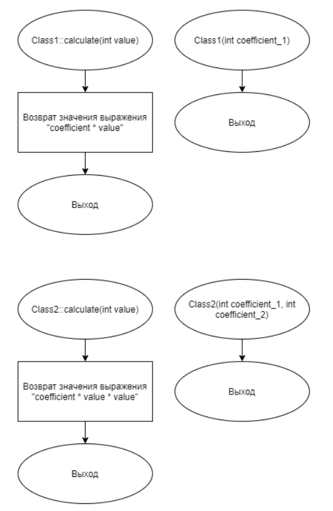
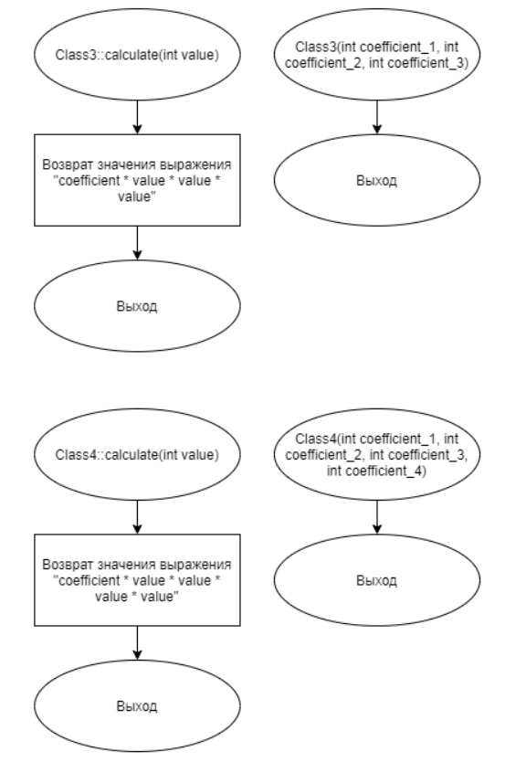
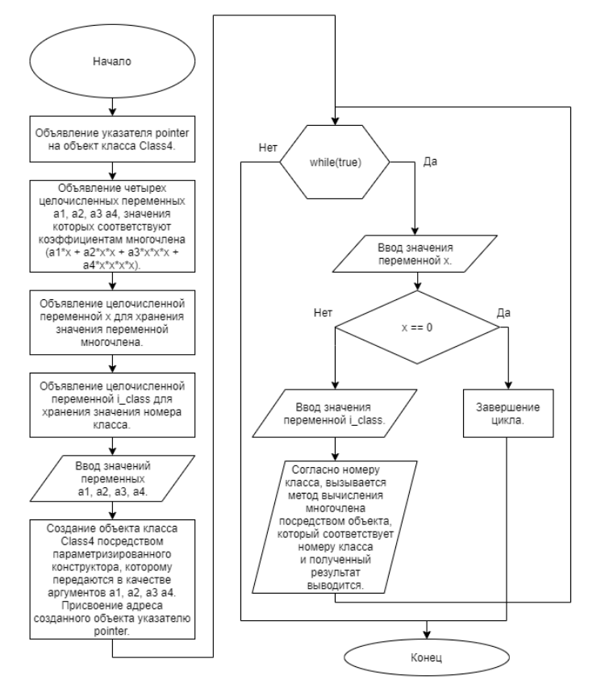

# Задание 3_05_1 | Виртуальные методы

## 1. Постановка задачи
Разработать систему, которая демонстрирует реализацию принципа полиморфизма при иерархическом конструировании объекта.

Спроектировать 4 разных объекта. Перенумеровать классы их принадлежности от 1 до 4. Каждый объект имеет свойство целочисленного типа в закрытом доступе. Это свойство хранит значение коэффициента многочлена, соответствующее номеру класса. Его значение определяется в конструкторе объекта, посредством значений параметра целочисленного типа.

У каждого объекта есть метод в открытом доступе, с одинаковым наименованием. У этого метода есть один целочисленный параметр, который содержит значение переменной многочлена. Метод вычисляет значение многочлена степени согласно номеру класса принадлежности объекта и возвращает полученный целочисленный результат.

Сконструировать иерархию вложенных объектов (наследственность объектов). Объект второго класса содержит в своем составе объект первого класса. Объект третьего класса содержит в своем составе объект второго класса. Объект четвертого класса содержит в своем составе объект третьего класса. Обеспечить передачу необходимых коэффициентов конструкторам объектов согласно наследственности.

Алгоритм конструирования и отработки системы:
1. Объявляется указатель на объект четвёртого класса.
2. Объявляются четыре целочисленные переменные a1, a2, a3 a4, значения которых соответствуют коэффициентам многочлена (a1\*x + a2\*x\*x + a3\*x\*x\*x + a4\*x\*x\*x\*x).
3. Объявляется целочисленная переменная x, для хранения значения переменной многочлена.
4. Объявляется целочисленная переменная i_class, для хранения значения номера класса.
5. Вводятся значения переменных a1, a2, a3, a4.
6. Создается объект класс 4 посредством параметризированного конструктора, которому передаются в качестве аргументов a1, a2, a3 a4. Адрес объекта присваивается объявленному указателю.
7. Начало цикла  
    7.1. Вводится значение переменной x.  
    7.2. Если значение x равно нулю, то цикл завершается.  
    7.3. Иначе, вводится значение номера класса.  
    7.4. Согласно номеру класса, вызывается метод вычисления многочлена посредством объекта, который соответствует номеру класса и полученный результат выводится.  
8. Конец цикла.
9. Завершается работа системы.

### 1.1 Описание входных данных
**Первая строка:**  
`«целое число, значение a1» «целое число, значение a2» «целое число, значение a3» «целое число, значение a4»`

**Начиная со второй строки, построчно:**  
`«целое число, значение х» «целое число, номер класса»`

### 1.2 Описание выходных данных
**Первая строка:**  
`a1 = «целое число» a2 = «целое число» a3 = «целое число» a4 = «целое число»`  
*Наименование коэффициента отделяется от предыдущего целого числа четырьмя
пробелами.*

**Со второй строки и далее построчно:**  
`Class «номер класса» F( «значение переменной x» ) = «значение многочлена»`  
*Фрагменту «F(» предшествует 4 пробела*


## 2. Метод решения
*Используемые объекты:*
- объект pointer класса Class4 предназначен для демонстрации работы виртуальных методов

*Используемые функции:*
- функция main для определения точки входа программы

*Другие инструменты:*
- библиотека iostream для поддержки ввода\вывода
- указатель
- заголовочный файл

**Класс Class1:**
- свойства/поля:
  - поле coefficient:
    - описание назначения: хранение целочисленного значения коэффициента многочлена,соответствующего номеру класса
    - наименование: coefficient
    - тип: int
    - модификатор доступа: private
- функционал:
  - метод calculate: вычисление значения многочлена степени согласно номеру класса принадлежности объекта и возврат полученного целочисленного результата
  - метод Class1: параметризированный конструктор

**Класс Class2:**
- базовые классы:
    - public Class1
- свойства/поля:
  - поле coefficient:
    - описание назначения: хранение целочисленного значения коэффициента многочлена,соответствующего номеру класса
    - наименование: coefficient
    - тип: int
    - модификатор доступа: private
- функционал:
  - метод calculate: вычисление значения многочлена степени согласно номеру класса принадлежности объекта и возврат полученного целочисленного результата
  - метод Class2: параметризированный конструктор

**Класс Class3:**
- базовые классы:
    - public Class2
- свойства/поля:
  - поле coefficient:
    - описание назначения: хранение целочисленного значения коэффициента многочлена,соответствующего номеру класса
    - наименование: coefficient
    - тип: int
    - модификатор доступа: private
- функционал:
  - метод calculate: вычисление значения многочлена степени согласно номеру класса принадлежности объекта и возврат полученного целочисленного результата
  - метод Class3: параметризированный конструктор

**Класс Class4:**
- базовые классы:
    - public Class3
- свойства/поля:
  - поле coefficient:
    - описание назначения: хранение целочисленного значения коэффициента многочлена,соответствующего номеру класса
    - наименование: coefficient
    - тип: int
    - модификатор доступа: private
- функционал:
  - метод calculate: вычисление значения многочлена степени согласно номеру класса принадлежности объекта и возврат полученного целочисленного результата
  - метод Class4: параметризированный конструктор

## 3. Описание алгоритмов

### 3.1 Алгоритм метода calculate класса Class1
Метод/функция: Метод  
Класс объекта: Class1  
Модификатор доступа: public  
Имя: calculate  
Параметры: int value  
Возвращаемое значение: int  
Функционал: Вычисление значения многочлена степени согласно номеру класса принадлежности объекта и возврат полученного целочисленного результата  
<table>
    <thead>
        <tr>
            <th>№</th>
            <th>Предикат</th>
            <th>Действия</th>
            <th>№ перехода</th>
        </tr>
    </thead>
    <tbody>
        <tr>
            <td>1</td>
            <td></td>
            <td>Возврат значения выражения "coefficient * value"</td>
            <td>0</td>
        </tr>
    </tbody>
</table>

### 3.2 Алгоритм конструктора класса Class1
Метод/функция: Конструктор  
Класс объекта: Class1  
Модификатор доступа: public  
Параметры: int coefficient_1  
Функционал: Параметризированный конструктор  
<table>
    <thead>
        <tr>
            <th>№</th>
            <th>Предикат</th>
            <th>Действия</th>
            <th>№ перехода</th>
        </tr>
    </thead>
    <tbody>
        <tr>
            <td>1</td>
            <td></td>
            <td></td>
            <td>0</td>
        </tr>
    </tbody>
</table>

### 3.3 Алгоритм метода calculate класса Class2
Метод/функция: Метод  
Класс объекта: Class2  
Модификатор доступа: public  
Имя: calculate  
Параметры: int value  
Возвращаемое значение: int  
Функционал: Вычисление значения многочлена степени согласно номеру класса принадлежности объекта и возврат полученного целочисленного результата  
<table>
    <thead>
        <tr>
            <th>№</th>
            <th>Предикат</th>
            <th>Действия</th>
            <th>№ перехода</th>
        </tr>
    </thead>
    <tbody>
        <tr>
            <td>1</td>
            <td></td>
            <td>Возврат значения выражения "coefficient * value * value"</td>
            <td>0</td>
        </tr>
    </tbody>
</table>

### 3.4 Алгоритм конструктора класса Class2
Метод/функция: Конструктор  
Класс объекта: Class2  
Модификатор доступа: public  
Параметры: int coefficient_1, int coefficient_2  
Функционал: Параметризированный конструктор  
<table>
    <thead>
        <tr>
            <th>№</th>
            <th>Предикат</th>
            <th>Действия</th>
            <th>№ перехода</th>
        </tr>
    </thead>
    <tbody>
        <tr>
            <td>1</td>
            <td></td>
            <td></td>
            <td>0</td>
        </tr>
    </tbody>
</table>

### 3.5 Алгоритм метода calculate класса Class3
Метод/функция: Метод  
Класс объекта: Class3  
Модификатор доступа: public  
Имя: calculate  
Параметры: int value  
Возвращаемое значение: int  
Функционал: Вычисление значения многочлена степени согласно номеру класса принадлежности объекта и возврат полученного целочисленного результата  
<table>
    <thead>
        <tr>
            <th>№</th>
            <th>Предикат</th>
            <th>Действия</th>
            <th>№ перехода</th>
        </tr>
    </thead>
    <tbody>
        <tr>
            <td>1</td>
            <td></td>
            <td>Возврат значения выражения "coefficient * value * value * value"</td>
            <td>0</td>
        </tr>
    </tbody>
</table>

### 3.6 Алгоритм конструктора класса Class3
Метод/функция: Конструктор  
Класс объекта: Class3  
Модификатор доступа: public  
Параметры: int coefficient_1, int coefficient_2, int coefficient_3  
Функционал: Параметризированный конструктор  
<table>
    <thead>
        <tr>
            <th>№</th>
            <th>Предикат</th>
            <th>Действия</th>
            <th>№ перехода</th>
        </tr>
    </thead>
    <tbody>
        <tr>
            <td>1</td>
            <td></td>
            <td></td>
            <td>0</td>
        </tr>
    </tbody>
</table>

### 3.7 Алгоритм метода calculate класса Class4
Метод/функция: Метод  
Класс объекта: Class4  
Модификатор доступа: public  
Имя: calculate  
Параметры: int value  
Возвращаемое значение: int  
Функционал: Вычисление значения многочлена степени согласно номеру класса принадлежности объекта и возврат полученного целочисленного результата  
<table>
    <thead>
        <tr>
            <th>№</th>
            <th>Предикат</th>
            <th>Действия</th>
            <th>№ перехода</th>
        </tr>
    </thead>
    <tbody>
        <tr>
            <td>1</td>
            <td></td>
            <td>Возврат значения выражения "coefficient * value * value * value * value"</td>
            <td>0</td>
        </tr>
    </tbody>
</table>

### 3.8 Алгоритм конструктора класса Class4
Метод/функция: Конструктор  
Класс объекта: Class4  
Модификатор доступа: public  
Параметры: int coefficient_1, int coefficient_2, int coefficient_3, int coefficient_4  
Функционал: Параметризированный конструктор  
<table>
    <thead>
        <tr>
            <th>№</th>
            <th>Предикат</th>
            <th>Действия</th>
            <th>№ перехода</th>
        </tr>
    </thead>
    <tbody>
        <tr>
            <td>1</td>
            <td></td>
            <td></td>
            <td>0</td>
        </tr>
    </tbody>
</table>

### 3.9 Алгоритм функции main
Метод/функция: Функция  
Имя: main  
Параметры: void  
Возвращаемое значение: int  
Функционал: определение точки входа программы  
<table>
    <thead>
        <tr>
            <th>№</th>
            <th>Предикат</th>
            <th>Действия</th>
            <th>№ перехода</th>
        </tr>
    </thead>
    <tbody>
        <tr>
            <td>1</td>
            <td></td>
            <td>Объявление указателя pointer на объект класса Class4.</td>
            <td>2</td>
        </tr>
        <tr>
            <td>2</td>
            <td></td>
            <td>Объявление четырех целочисленных переменных a1, a2, a3, a4, значения которых соответствуют коэффициентам многочлена (a1*x + a2*x*x +a3*x*x*x + a4*x*x*x*x).</td>
            <td>3</td>
        </tr>
        <tr>
            <td>3</td>
            <td></td>
            <td>Объявление целочисленной переменной x для хранения значения переменной многочлена.</td>
            <td>4</td>
        </tr>
        <tr>
            <td>4</td>
            <td></td>
            <td>Объявление целочисленной переменной i_class для хранения значения номера класса.</td>
            <td>5</td>
        </tr>
        <tr>
            <td>5</td>
            <td></td>
            <td>Ввод значений переменных a1, a2, a3, a4.</td>
            <td>6</td>
        </tr>
        <tr>
            <td>6</td>
            <td></td>
            <td>Создание объекта класса Class4 посредством параметризированного конструктора, которому передаются в качестве аргументов a1, a2, a3 a4. Присвоение адреса созданного объекта указателю pointer.</td>
            <td>7</td>
        </tr>
        <tr>
            <td rowspan="2">7</td>
            <td>true</td>
            <td>Ввод значения переменной x.</td>
            <td>8</td>
        </tr>
        <tr>
            <td></td>
            <td></td>
            <td>0</td>
        </tr>
        <tr>
            <td rowspan="2">8</td>
            <td>x == 0</td>
            <td></td>
            <td>0</td>
        </tr>
        <tr>
            <td></td>
            <td>Ввод значения переменной i_class.</td>
            <td>9</td>
        </tr>
        <tr>
            <td>9</td>
            <td></td>
            <td>Согласно номеру класса, вызывается метод вычисления многочлена посредством объекта, который соответствует номеру класса и полученный результат выводится.</td>
            <td>0</td>
        </tr>
    </tbody>
</table>


## 4. Блок-схемы алгоритмов





## 5. Код программы

### 5.1 Файл Class1.h
```cpp
#ifndef __CLASS1__H
#define __CLASS1__H


class Class1
{
public:
    int calculate(int value);
    
    Class1(int coefficient_1);
    
private:
    int coefficient = 0;
};

#endif
```

### 5.2 Файл Class1.cpp
```cpp
#include "Class1.h"


int Class1::calculate(int value)
{
    return coefficient * value;
}

Class1::Class1(int coefficient_1) : coefficient{coefficient_1} {}
```

### 5.3 Файл Class2.h
```cpp
#ifndef __CLASS2__H
#define __CLASS2__H
#include "Class1.h"


class Class2 : public Class1
{
public:
    int calculate(int value);
    Class2(int coefficient_1, int coefficient_2);
private:
    int coefficient = 0;
};


#endif
```

### 5.4 Файл Class2.cpp
```cpp
#include "Class2.h"


int Class2::calculate(int value)
{
    return coefficient * value * value + Class1::calculate(value);
}
Class2::Class2(int coefficient_1, int coefficient_2): Class1(coefficient_1), coefficient{coefficient_2} {}
```

### 5.5 Файл Class3.h
```cpp
#ifndef __CLASS3__H
#define __CLASS3__H
#include "Class2.h"


class Class3 : public Class2
{
public:
    int calculate(int value);
    Class3(int coefficient_1, int coefficient_2, int coefficient_3);
private:
    int coefficient = 0;
};


#endif
```

### 5.6 Файл Class3.cpp
```cpp
#include "Class3.h"


int Class3::calculate(int value)
{
    return coefficient * value * value * value + Class2::calculate(value);
}
Class3::Class3(int coefficient_1, int coefficient_2, int coefficient_3): Class2(coefficient_1, coefficient_2), coefficient{coefficient_3} {}
```

### 5.7 Файл Class4.h
```cpp
#ifndef __CLASS4__H
#define __CLASS4__H
#include "Class3.h"


class Class4 : public Class3
{
public:
    int calculate(int value);

    Class4(int coefficient_1, int coefficient_2, int coefficient_3, int coefficient_4);
private:
    int coefficient = 0;
};


#endif
```

### 5.8 Файл Class4.cpp
```cpp
#include "Class4.h"


int Class4::calculate(int value)
{
    return coefficient * value * value * value * value + Class3::calculate(value);
}

Class4::Class4(int coefficient_1, int coefficient_2, int coefficient_3, int coefficient_4): Class3(coefficient_1, coefficient_2, coefficient_3), coefficient{coefficient_4} {}
```

### 5.9 Файл main.cpp
```cpp
#include <iostream>
#include "Class1.h"
#include "Class2.h"
#include "Class3.h"
#include "Class4.h"


int main()
{
    Class4* pointer;
    int a1, a2, a3, a4;
    int x = 0;
    int i_class = 0;

    std::cin >> a1 >> a2 >> a3 >> a4;
    pointer = new Class4(a1, a2, a3, a4);

    std::cout << "a1 = " << a1 << " " <<
                    "a2 = " << a2 << " " <<
                    "a3 = " << a3 << " " <<
                    "a4 = " << a4 << std::endl;
    
    while(true)
    {
    std::cin >> x;
    if(x == 0) break;
    std::cin >> i_class;
    switch(i_class)
        {
        case 1:
            std::cout << "Class 1" << " " << "F( " << x << " ) = " <<
                pointer->Class1::calculate(x) << std::endl;
            break;
        case 2:
            std::cout << "Class 2" << " " << "F( " << x << " ) = " <<
                pointer->Class2::calculate(x) << std::endl;
            break;
        case 3:
            std::cout << "Class 3" << " " << "F( " << x << " ) = " <<
                pointer->Class3::calculate(x) << std::endl;
            break;
        case 4:
            std::cout << "Class 4" << " " << "F( " << x << " ) = " <<
                pointer->Class4::calculate(x) << std::endl;
            break;
        default:
            break;
        }
    }
    return(0);
}
```

## 6. Тестирование
<table>
    <thead>
        <tr>
            <th>Входные данные</th>
            <th>Ожидаемые выходные данные</th>
            <th>Фактические выходные данные</th>
        </tr>
    </thead>
    <tbody>
        <tr>
            <td>
                <pre>
6 8 4 3
4 2
0
                </pre>
            </td>
            <td>
                <pre>
a1 = 6    a2 = 8    a3 = 4    a4 = 3
Class 2    F( 4 ) = 152
                </pre>
            </td>
            <td>
                <pre>
a1 = 6    a2 = 8    a3 = 4    a4 = 3
Class 2    F( 4 ) = 152
                </pre>
            </td>
        </tr>
        <tr>
            <td>
                <pre>
4 3 2 1
9 1
0
                </pre>
            </td>
            <td>
                <pre>
a1 = 4    a2 = 3    a3 = 2    a4 = 1
Class 1    F( 9 ) = 36
                </pre>
            </td>
            <td>
                <pre>
a1 = 4    a2 = 3    a3 = 2    a4 = 1
Class 1    F( 9 ) = 36
                </pre>
            </td>
        </tr>
    </tbody>
</table>
