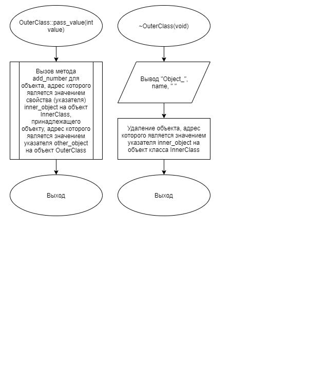

# Задание 3_08_1 | Вложенные классы

## 1. Постановка задачи
Разработать систему, которая демонстрирует возможность размещения и использования объекта одного класса в составе объекта другого класса. При этом, жизненный цикл внутреннего объекта полностью реализуется в рамках внешнего объекта.

Спроектировать внешний объект, который содержит внутренний объект в закрытом доступе. Содержит свойство строкового типа для хранения наименования объекта в закрытом доступе. 

Внутренний объект имеет одно целочисленное свойство, в закрытом доступе, для хранения суммы полученных целочисленных значений. Внутренний объект имеет метод в открытом доступе, с одним целочисленным параметром, который суммирует полученные по параметру значения.

В деструкторе внутреннего объекта выводиться значение полученной в процессе функционирования объекта суммы.

Внешний объект имеет параметризированный конструктор, с параметром строкового типа, который передает наименование объекта.

Внешний объект имеет метод с целочисленным параметром в открытом доступе, который передает значение этого параметра другому внешнему объекту посредством вызова метода и последующего суммирования.

Внешний объект имеет деструктор, который выводит "Object_" и наименование объекта.

Организовать связи между объектами.

Для организации связи между объектами добавить не более одного метода в открытом доступе к внешнему объекту, не более одного свойства и одного метода в открытом доступе внутреннему объекту.

Алгоритм конструирования и отработки системы:
1. Объявляется строковая переменная.
2. Вводиться наименование первого внешнего объекта.
3. Объявляется первый объект внешнего класса, с использованием
параметризированного конструктора.
4. Вводиться наименование второго внешнего объекта.
5. Объявляется второй объект внешнего класса, с использованием
параметризированного конструктора.
6. Организуется связь между объектами.
7. Объявляется целочисленная переменная, для хранения номера внешнего
объекта.
8. Объявляется целочисленная переменная, для хранения целочисленного
значения.
9. Начало цикла.  
9.1. Вводится номер внешнего объекта и целочисленное значение.  
9.2. Если номер внешнего объекта равно 0, работа цикла завершается.  
9.3. Вызывается метод внешнего объекта согласно введенному номеру и передается в качестве аргумента переменная с целочисленным значением, которое посредством организованной связи предается другому внешнему объекту.  
10. Конец цикла.
11. Завершается работа системы

### 1.1 Описание входных данных
**Первая строка:**  
`«наименование первого объекта»`

**Вторая строка:**  
`«наименование второго объекта»`

**Начиная с третьей строки, построчно:**  
`«целое число, номер объекта» «целое число»`

**Последняя строка:**  
`0`

**Пример ввода:**
```
ffff
ssss
1 1
2 2
2 2
1 4
0
```

### 1.2 Описание выходных данных
**Первая строка:**  
```
Object_«наименование второго объекта» SUMM = «целое число, значение суммы»
```  

**Начиная со второй строки, построчно:**  
```
Object_«наименование первого объекта» SUMM = «целое число, значение суммы»
```

**Пример вывода:**
```
Object_ssss SUMM = 5
Object_ffff SUMM = 4
```


## 2. Метод решения
*Используемые функции:*
- объект object_1 класса OuterClass предназначен для демонстрации работы вложенных классов
- объект object_2 класса OuterClass предназначен для демонстрации работы вложенных классов
- функция main для определения точки входа программы
- библиотека iostream для поддержки ввода\вывода
- указатель
- заголовочный файл
- строка
- класс

**Класс InnerClass:**
- свойства/поля:
  - поле sum:
    - описание назначения: хранение суммы полученных целочисленных значений
    - наименование: sum
    - тип: int
    - модификатор доступа: private
- функционал:
  - метод add_number: суммирование полученных по параметру значений
  - метод ~InnerClas: деструктор; вывод значения полученной в процессе функционирования объекта суммы

**Класс OuterClass:**
- свойства/поля:
  - поле name:
    - описание назначения: хранение наименования объекта в закрытом доступе
    - наименование: name
    - тип: std::string
    - модификатор доступа: private
  - поле other_object:
    - описание назначения: связь с другим внешним объектом
    - наименование: other_object
    - тип: OuterClass
    - модификатор доступа: private
  - поле inner_object:
    - описание назначения: внутренний объект
    - наименование: inner_object
    - тип: InnerClass*
    - модификатор доступа: private
- функционал:
  - метод OuterClass: параметризированный конструктор; инициализация полей name и inner_object
  - метод set_other_object: инициализация указателя other_object на объект класса OuterClass
  - метод pass_value — передача значения параметра другому внешнему объекту посредством вызова метода и последующего суммирования
  - метод ~OuterClass: деструктор; вывод имени объекта

## 3. Описание алгоритмов

### 3.1 Алгоритм метода add_number класса InnerClass
Метод/функция: Метод  
Класс объекта: InnerClass  
Модификатор доступа: public  
Имя: add_number  
Параметры: int number  
Возвращаемое значение: void  
Функционал: суммирование полученных по параметру значений  
<table>
    <thead>
        <tr>
            <th>№</th>
            <th>Предикат</th>
            <th>Действия</th>
            <th>№ перехода</th>
        </tr>
    </thead>
    <tbody>
        <tr>
            <td>1</td>
            <td></td>
            <td>Добавление целочисленного значения параметра number к целочисленному значению свойства sum</td>
            <td>0</td>
        </tr>
    </tbody>
</table>

### 3.2 Алгоритм деструктора класса InnerClass
Метод/функция: Деструктор  
Класс объекта: InnerClass  
Модификатор доступа: public  
Параметры: void  
Функционал: Параметризированный конструктор  
<table>
    <thead>
        <tr>
            <th>№</th>
            <th>Предикат</th>
            <th>Действия</th>
            <th>№ перехода</th>
        </tr>
    </thead>
    <tbody>
        <tr>
            <td>1</td>
            <td></td>
            <td>Вывод "SUMM = ", sum</td>
            <td>0</td>
        </tr>
    </tbody>
</table>

### 3.3 Алгоритм конструктора класса OuterClass
Метод/функция: Конструктор  
Класс объекта: OuterClass  
Модификатор доступа: public  
Параметры: std::string inner_object_name  
Функционал: Параметризированный конструктор  
<table>
    <thead>
        <tr>
            <th>№</th>
            <th>Предикат</th>
            <th>Действия</th>
            <th>№ перехода</th>
        </tr>
    </thead>
    <tbody>
        <tr>
            <td>1</td>
            <td></td>
            <td>Присвоение значения параметра строкового типа inner_object_name свойству строкового типа name</td>
            <td>2</td>
        </tr>
        <tr>
            <td>2</td>
            <td></td>
            <td>Инициализация указателя inner_object на объект класса InnerClass</td>
            <td>0</td>
        </tr>
    </tbody>
</table>

### 3.4 Алгоритм метода set_other_object класса OuterClass
Метод/функция: Метод  
Класс объекта: OuterClass  
Модификатор доступа: public  
Имя: set_other_object  
Параметры: OuterObject* other_object  
Возвращаемое значение: void  
Функционал: инициализация указателя other_object на объект класса OuterClass  
<table>
    <thead>
        <tr>
            <th>№</th>
            <th>Предикат</th>
            <th>Действия</th>
            <th>№ перехода</th>
        </tr>
    </thead>
    <tbody>
        <tr>
            <td>1</td>
            <td></td>
            <td>Присвоение значения параметра address указателю other_object на объект класса OuterObject</td>
            <td>0</td>
        </tr>
    </tbody>
</table>

### 3.5 Алгоритм метода pass_value класса OuterClass
Метод/функция: Метод  
Класс объекта: OuterClass  
Модификатор доступа: public  
Имя: pass_value  
Параметры: int value  
Возвращаемое значение: void  
Функционал: инициализация указателя other_object на объект класса OuterClass  
<table>
    <thead>
        <tr>
            <th>№</th>
            <th>Предикат</th>
            <th>Действия</th>
            <th>№ перехода</th>
        </tr>
    </thead>
    <tbody>
        <tr>
            <td>1</td>
            <td></td>
            <td>Вызов метода add_number для объекта, адрес которого является значением свойства (указателя) inner_object на объект InnerClass, принадлежащего объекту, адрес которого является значением
            указателя other_object на объект OuterClass</td>
            <td>0</td>
        </tr>
    </tbody>
</table>

### 3.6 Алгоритм метода деструктора класса OuterClass
Метод/функция: Деструктор  
Класс объекта: OuterClass  
Модификатор доступа: public  
Параметры: void  
Функционал: деструктор; вывод имени объекта  
<table>
    <thead>
        <tr>
            <th>№</th>
            <th>Предикат</th>
            <th>Действия</th>
            <th>№ перехода</th>
        </tr>
    </thead>
    <tbody>
        <tr>
            <td>1</td>
            <td></td>
            <td>Вывод "Object_", name, "</td>
            <td>2</td>
        </tr>
        <tr>
            <td>2</td>
            <td></td>
            <td>Удаление объекта, адрес которого является значением указателя inner_object на объект класса InnerClass</td>
            <td>0</td>
        </tr>
    </tbody>
</table>

### 3.7 Алгоритм функции main
Метод/функция: Функция  
Имя: main  
Параметры: void  
Возвращаемое значение: int  
Функционал: определение точки входа программы  
<table>
    <thead>
        <tr>
            <th>№</th>
            <th>Предикат</th>
            <th>Действия</th>
            <th>№ перехода</th>
        </tr>
    </thead>
    <tbody>
        <tr>
            <td>1</td>
            <td></td>
            <td>Объявление переменной строкового типа name</td>
            <td>2</td>
        </tr>
        <tr>
            <td>2</td>
            <td></td>
            <td>Ввод значения name</td>
            <td>3</td>
        </tr>
        <tr>
            <td>3</td>
            <td></td>
            <td>Инициализация объекта object_1 класса OuterClass с передачей значения name в качестве параметра</td>
            <td>4</td>
        </tr>
        <tr>
            <td>4</td>
            <td></td>
            <td>Ввод значения name</td>
            <td>5</td>
        </tr>
        <tr>
            <td>5</td>
            <td></td>
            <td>Инициализация объекта object_2 класса OuterClass с передачей значения name в качестве параметра</td>
            <td>6</td>
        </tr>
        <tr>
            <td>6</td>
            <td></td>
            <td>Вызов метода set_other_object для объекта, адрес которого является значением указателя object_1, с передачей значения object_2 в качестве параметра</td>
            <td>7</td>
        </tr>
        <tr>
            <td>7</td>
            <td></td>
            <td>Вызов метода set_other_object для объекта, адрес которого является значением указателя object_2, с передачей значения object_1 в качестве параметра</td>
            <td>8</td>
        </tr>
        <tr>
            <td>8</td>
            <td></td>
            <td>Объявление целочисленной переменной object_index</td>
            <td>9</td>
        </tr>
        <tr>
            <td>9</td>
            <td></td>
            <td>Объявление целочисленной переменной value</td>
            <td>10</td>
        </tr>
        <tr>
            <td rowspan="2">10</td>
            <td>true</td>
            <td>Ввод значения object_index</td>
            <td>11</td>
        </tr>
        <tr>
            <td></td>
            <td></td>
            <td>0</td>
        </tr>
        <tr>
            <td rowspan="2">11</td>
            <td>object_index == 0</td>
            <td></td>
            <td>0</td>
        </tr>
        <tr>
            <td></td>
            <td></td>
            <td>12</td>
        </tr>
        <tr>
            <td>12</td>
            <td></td>
            <td>Ввод значения value</td>
            <td>13</td>
        </tr>
        <tr>
            <td>13</td>
            <td>object_index == 1</td>
            <td>Вызов метода pass_value для объекта, адрес которого является значением указателя object_1 с передачей значения value в качестве параметра</td>
            <td>10</td>
        </tr>
        <tr>
            <td>14</td>
            <td>object_index == 2</td>
            <td>Вызов метода pass_value для объекта, адрес которого является значением указателя object_2 с передачей значения value в качестве параметра</td>
            <td>10</td>
        </tr>
    </tbody>
</table>


## 4. Блок-схемы алгоритмов




## 5. Код программы

### 5.1 Файл InnerClass.h
```cpp
#ifndef __INNERCLASS__H
#define __INNERCLASS__H

#include <string>
#include <iostream>


class InnerClass
{
public:
    void add_number(int value);

    ~InnerClass();

private:
    int sum = 0;
};

#endif
```

### 5.2 Файл InnerClass.cpp
```cpp
#include "InnerClass.h"


void InnerClass::add_number(int number)
{
    sum += number;
}

InnerClass::~InnerClass()
{
    std::cout << "SUMM = " << sum << std::endl;
}
```

### 5.3 Файл OuterClass.h
```cpp
#ifndef __OUTERCLASS__H
#define __OUTERCLASS__H

#include <string>
#include "InnerClass.h"


class OuterClass
{
public:
    void set_other_object(OuterClass* address);
    void pass_value(int value);

    OuterClass(std::string name);
    ~OuterClass();

private:
    std::string name;OuterClass* other_object;InnerClass* inner_object;
};

#endif
```

### 5.4 Файл OuterClass.cpp
```cpp
#include "OuterClass.h"


void OuterClass::set_other_object(OuterClass* address)
{
    other_object = address;
}

void OuterClass::pass_value(int value)
{
    other_object->inner_object->add_number(value);
}

OuterClass::OuterClass(std::string inner_object_name): name{inner_object_name}
{
    inner_object = new InnerClass();
}

OuterClass::~OuterClass()
{
    std::cout << "Object_" << name << " ";
    delete inner_object;
}
```

### 5.5 Файл main.cpp
```cpp
#include "OuterClass.h"
#include <iostream>


int main()
{
    std::string name;

    std::cin >> name;
    OuterClass object_1(name);

    std::cin >> name;
    OuterClass object_2(name);

    object_1.set_other_object(&object_2);
    object_2.set_other_object(&object_1);

    int object_index;
    int value;

    while(true)
    {
        std::cin >> object_index;
        if(object_index == 0) break;
        std::cin >> value;

        switch(object_index)
        {
            case 1:
                object_1.pass_value(value);
                break;
            case 2:
                object_2.pass_value(value);
                break;
            default:
                break;
        }
    }
    return 0;
}
```

## 6. Тестирование
<table>
    <thead>
        <tr>
            <th>Входные данные</th>
            <th>Ожидаемые выходные данные</th>
            <th>Фактические выходные данные</th>
        </tr>
    </thead>
    <tbody>
        <tr>
            <td>
                <pre>
ffff
ssss
1 1
2 2
2 2
1 4
0
                </pre>
            </td>
            <td>
                <pre>
Object_ssss SUMM = 5
Object_ffff SUMM = 4
                </pre>
            </td>
            <td>
                <pre>
Object_ssss SUMM = 5
Object_ffff SUMM = 4
                </pre>
            </td>
        </tr>
    </tbody>
</table>
