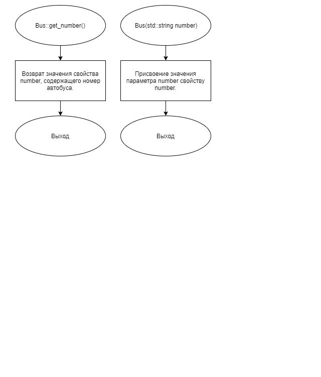
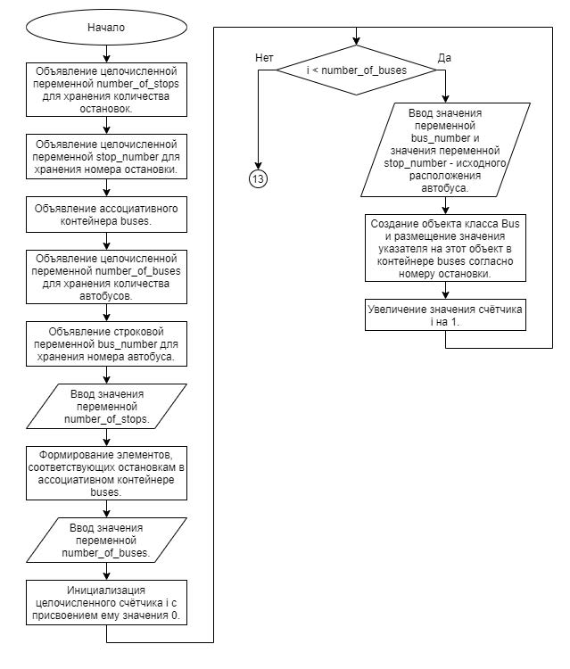
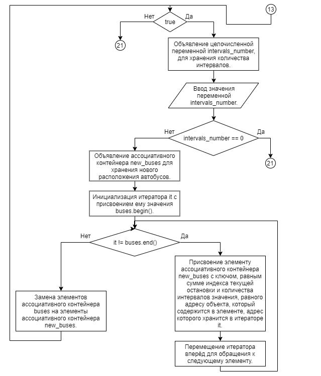
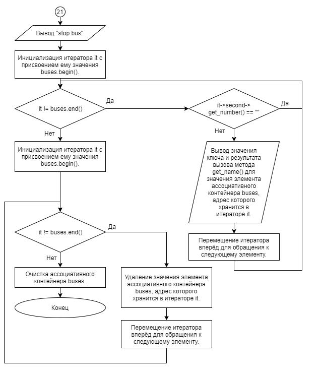

# Задание 3_10_1 | Контейнеры и итераторы

## 1. Постановка задачи
Разработать систему, которая моделирует движение автобусов по круговому маршруту с односторонним движением. Время движения между остановками одинаковое (одинаковый временной интервал). Остановки пронумерованы от 1 до n.

Сопоставить автобусу объект, у которого одно свойство строкового типа в закрытом доступе, для хранения номера автобуса.

Объект имеет конструктор с одним параметром строкового типа. Параметр содержит номер автобуса и его значение присваивается свойству с закрытым доступом.

Объект имеет метод в открытом доступе, который возвращает значение номера автобуса.

Расположение автобусов на маршруте моделировать (отобразить) ассоциативным контейнером, в котором значение ключа соответствует номеру остановки, которому ставиться в соответствие указатель на объект автобуса, который находится на остановке. Допускаем, что на остановке может находиться только один автобус. Предполагается, что количество автобусов меньше количества остановок.

Алгоритм конструирования и отработки системы:
1. Объявляется целочисленная переменная, для хранения количества остановок.
2. Объявляется целочисленная переменная, для хранения номера остановки.
3. Объявляется ассоциативный контейнер.
4. Объявляется целочисленная переменная, для хранения количества автобусов.
5. Объявляется строковая переменная, для хранения номера автобуса.
6. Вводится значение количества остановок.
7. В ассоциативном контейнере формируются элементы, которые соответствуют остановкам.
8. Вводится значение количества автобусов.
9. Цикл от единицы до количества автобусов.  
9.1. Вводится значение номере автобуса и значение номера остановки исходного расположения автобуса.  
9.2. Создание объекта автобус и размещение значение указателя на этот объект в контейнере согласно номеру остановки.  
10. Конец цикла.
11. Начало цикла.  
11.1. Вводится целочисленное значение, которое равно количеству интервалов.  
11.2. Если значение интервала равно нулю, то выход из цикла.  
11.3. Реализуется перемещение автобусов по маршруту.  
12. Конец цикла.
13. Выводится в информация итогового расположения автобусов на маршруте построчно. Строка содержит: номер остановки и номер автобуса.
14. Очищается контейнер и удаляются объекты автобусов.
15. Завершается работа системы.

При сдаче предложите более оптимальное решение задачи. Обоснуйте решение.

### 1.1 Описание входных данных
**Первая строка:**  
`«целое число, количество остановок»`

**Вторая строка:**  
`«целое число, количество автобусов»`

**Начиная с третьей строки, построчно, согласно количеству автобусов:**  
`«строка, номер автобуса» «целое число, номер исходного расположения автобуса»`

**Начиная со следующей строки:**  
`«целое число, количество интервалов»`

**Последняя строка:**  
`0`

**Пример ввода:**
```
10
3
77AP345 3
77AP115 9
77AP678 5
1
2
0
```

### 1.2 Описание выходных данных
**Первая строка:**  
```
stop    bus
```  

**Начиная со второй строки, построчно:**  
```
«номер остановки»       «номер автобуса»
```

**Пример вывода:**
```
stop    bus
2       77AP115
6       77AP345
8       77AP678
```


## 2. Метод решения
*Используемые функции:*
- функция main для определения точки входа программы
- библиотека iostream для поддержки ввода\вывода
- указатель
- заголовочный файл

**Класс Bus:**
- свойства/поля:
  - поле number:
    - описание назначения: хранение номера автобуса
    - наименование: number
    - тип: std::string
    - модификатор доступа: private
- функционал:
  - метод get_number: возврат значения свойства, содержащего номера автобуса
  - метод Bus: параметризированный конструктор

## 3. Описание алгоритмов

### 3.1 Алгоритм метода get_number класса Bus
Метод/функция: Метод  
Класс объекта: Bus  
Модификатор доступа: public  
Имя: get_number  
Параметры: void  
Возвращаемое значение: std::string  
Функционал: возврат значения свойства, содержащего номер автобуса  
<table>
    <thead>
        <tr>
            <th>№</th>
            <th>Предикат</th>
            <th>Действия</th>
            <th>№ перехода</th>
        </tr>
    </thead>
    <tbody>
        <tr>
            <td>1</td>
            <td></td>
            <td>Возврат значения свойства number, содержащего номер автобуса.</td>
            <td>0</td>
        </tr>
    </tbody>
</table>

### 3.2 Алгоритм конструктора класса Bus
Метод/функция: Конструктор  
Класс объекта: Bus  
Модификатор доступа: public  
Параметры: std::string number  
Функционал: Параметризированный конструктор  
<table>
    <thead>
        <tr>
            <th>№</th>
            <th>Предикат</th>
            <th>Действия</th>
            <th>№ перехода</th>
        </tr>
    </thead>
    <tbody>
        <tr>
            <td>1</td>
            <td></td>
            <td>Присвоение значения параметра number свойству number.</td>
            <td>0</td>
        </tr>
    </tbody>
</table>

### 3.3 Алгоритм функции main
Метод/функция: Функция  
Имя: main  
Параметры: void  
Возвращаемое значение: int  
Функционал: определение точки входа программы  
<table>
    <thead>
        <tr>
            <th>№</th>
            <th>Предикат</th>
            <th>Действия</th>
            <th>№ перехода</th>
        </tr>
    </thead>
    <tbody>
        <tr>
            <td>1</td>
            <td></td>
            <td>Объявление целочисленной переменной number_of_stops для хранения количества остановок.</td>
            <td>2</td>
        </tr>
        <tr>
            <td>2</td>
            <td></td>
            <td>Объявление целочисленной переменной stop_number для хранения номера остановки.</td>
            <td>3</td>
        </tr>
        <tr>
            <td>3</td>
            <td></td>
            <td>Объявление ассоциативного контейнера buses.</td>
            <td>4</td>
        </tr>
        <tr>
            <td>4</td>
            <td></td>
            <td>Объявление целочисленной переменной number_of_buses для хранения количества автобусов.</td>
            <td>5</td>
        </tr>
        <tr>
            <td>5</td>
            <td></td>
            <td>Объявление строковой переменной bus_number для хранения номера автобуса.</td>
            <td>6</td>
        </tr>
        <tr>
            <td>6</td>
            <td></td>
            <td>Ввод значения переменной number_of_stops.</td>
            <td>7</td>
        </tr>
        <tr>
            <td>7</td>
            <td></td>
            <td>Формирование элементов, соответствующих остановкам в ассоциативном контейнере buses.</td>
            <td>8</td>
        </tr>
        <tr>
            <td>8</td>
            <td></td>
            <td>Ввод значения переменной number_of_buses.</td>
            <td>9</td>
        </tr>
        <tr>
            <td>9</td>
            <td></td>
            <td>Инициализация целочисленного счётчика i с присвоением ему значения 0.</td>
            <td>10</td>
        </tr>
        <tr>
            <td rowspan="2">10</td>
            <td>i < number_of_buses</td>
            <td>Ввод значения переменной bus_number и значения переменной stop_number - исходного расположения автобуса.</td>
            <td>11</td>
        </tr>
        <tr>
            <td></td>
            <td></td>
            <td>13</td>
        </tr>
        <tr>
            <td>12</td>
            <td></td>
            <td>Увеличение значения счётчика i на 1.</td>
            <td>10</td>
        </tr>
        <tr>
            <td rowspan="2">13</td>
            <td>true</td>
            <td>Объявление целочисленной переменной intervals_number, для хранения количества интервалов.</td>
            <td>14</td>
        </tr>
        <tr>
            <td></td>
            <td></td>
            <td>20</td>
        </tr>
        <tr>
            <td>14</td>
            <td></td>
            <td>Ввод значения переменной intervals_number.</td>
            <td>15</td>
        </tr>
        <tr>
            <td rowspan="2">15</td>
            <td>intervals_number == 0</td>
            <td></td>
            <td>21</td>
        </tr>
        <tr>
            <td></td>
            <td></td>
            <td>16</td>
        </tr>
        <tr>
            <td>16</td>
            <td></td>
            <td>Объявление ассоциативного контейнера new_buses для хранения нового расположения автобусов.</td>
            <td>17</td>
        </tr>
        <tr>
            <td>17</td>
            <td></td>
            <td>Инициализация итератора it с присвоением ему значения buses.begin().</td>
            <td>18</td>
        </tr>
        <tr>
            <td rowspan="2">18</td>
            <td>it != buses.end()</td>
            <td>Присвоение элементу ассоциативного контейнера new_buses с ключом, равным сумме индекса текущей остановки и количества интервалов значения, равного адресу объекта, который содержится в элементе, адрес которого хранится в итераторе it.</td>
            <td>19</td>
        </tr>
        <tr>
            <td></td>
            <td></td>
            <td>20</td>
        </tr>
        <tr>
            <td>19</td>
            <td></td>
            <td>Перемещение итератора вперёд для обращения кследующему элементу.</td>
            <td>13</td>
        </tr>
        <tr>
            <td>20</td>
            <td></td>
            <td>Замена элементов ассоциативного контейнера buses на элементы ассоциативного контейнера new_buses.</td>
            <td>21</td>
        </tr>
        <tr>
            <td>21</td>
            <td></td>
            <td>Вывод "stop    bus".</td>
            <td>22</td>
        </tr>
        <tr>
            <td>22</td>
            <td></td>
            <td>Инициализация итератора it с присвоением ему значения buses.begin().</td>
            <td>23</td>
        </tr>
        <tr>
            <td rowspan="2">23</td>
            <td>it != buses.end()</td>
            <td></td>
            <td>24</td>
        </tr>
        <tr>
            <td></td>
            <td></td>
            <td>27</td>
        </tr>
        <tr>
            <td rowspan="2">24</td>
            <td>it->second->get_number() == ""</td>
            <td></td>
            <td>23</td>
        </tr>
        <tr>
            <td></td>
            <td></td>
            <td>25</td>
        </tr>
        <tr>
            <td>25</td>
            <td></td>
            <td>Вывод значения ключа и результата вызова метода get_name() для значения элемента ассоциативного контейнера buses, адрес которого хранится в итераторе it.</td>
            <td>26</td>
        </tr>
        <tr>
            <td>26</td>
            <td></td>
            <td>Перемещение итератора вперёд для обращения к следующему элементу.</td>
            <td>23</td>
        </tr>
        <tr>
            <td>27</td>
            <td></td>
            <td>Инициализация итератора it с присвоением ему значения buses.begin().</td>
            <td>28</td>
        </tr>
        <tr>
            <td rowspan="2">28</td>
            <td>it != buses.end()</td>
            <td>Удаление значения элемента ассоциативного контейнера buses, адрес которого хранится в итераторе it.</td>
            <td>29</td>
        </tr>
        <tr>
            <td></td>
            <td></td>
            <td>30</td>
        </tr>
        <tr>
            <td>29</td>
            <td></td>
            <td>Перемещение итератора вперёд для обращения к следующему элементу.</td>
            <td>28</td>
        </tr>
        <tr>
            <td>30</td>
            <td></td>
            <td>Очистка ассоциативного контейнера buses.</td>
            <td>0</td>
        </tr>
    </tbody>
</table>


## 4. Блок-схемы алгоритмов






## 5. Код программы

### 5.1 Файл Bus.h
```cpp
#ifndef __BUS__H
#define __BUS__H

#include <string>


class Bus
{
public:
    std::string get_number();

    Bus(std::string number);

private:
    std::string number;
};


#endif
```

### 5.2 Файл Bus.cpp
```cpp
#include "Bus.h"


std::string Bus::get_number()
{
    return number;
}

Bus::Bus(std::string number): number{number} {}
```

### 5.3 Файл main.cpp
```cpp
#include <iostream>
#include <map>
#include "Bus.h"


int main()
{
    int number_of_stops = 0;
    int stop_number = 0;

    std::map<int, Bus*> buses = {};

    int number_of_buses = 0;
    std::string bus_number;

    std::cin >> number_of_stops;

    for(int i = 0; i < number_of_stops; i++)
    {
        buses[i] = new Bus("");
    }

    std::cin >> number_of_buses;
    
    for(int i = 0; i < number_of_buses; i++)
    {
        std::cin >> bus_number;
        std::cin >> stop_number;
        buses[stop_number-1] = new Bus(bus_number);
    }

    while(true)
    {
        int intervals_number;
        std::cin >> intervals_number;
        if(intervals_number == 0) break;

        std::map<int, Bus*> new_buses = {};

        for(auto it = buses.begin(); it != buses.end(); it++)
        {
            new_buses[(it->first + intervals_number) % number_of_stops] = it->second;
        }
        buses = new_buses;
    }

    std::cout << "stop bus" << std::endl;

    for(auto it = buses.begin(); it != buses.end(); it++)
    {
        if(it->second->get_number() == "") continue;
        std::cout << it->first+1 << " " << it->second->get_number() << std::endl;
    }

    for(auto it = buses.begin(); it != buses.end(); it++)
    {
        delete it->second;
    }

    buses.clear();
    
    return 0;
}
```

## 6. Тестирование
<table>
    <thead>
        <tr>
            <th>Входные данные</th>
            <th>Ожидаемые выходные данные</th>
            <th>Фактические выходные данные</th>
        </tr>
    </thead>
    <tbody>
        <tr>
            <td>
                <pre>
10
3
77AP345 3
77AP115 9
77AP678 5
1
2
0
                </pre>
            </td>
            <td>
                <pre>
stop bus
2 77AP115
6 77AP345
8 77AP678
                </pre>
            </td>
            <td>
                <pre>
stop bus
2 77AP115
6 77AP345
8 77AP678
                </pre>
            </td>
        </tr>
    </tbody>
</table>
