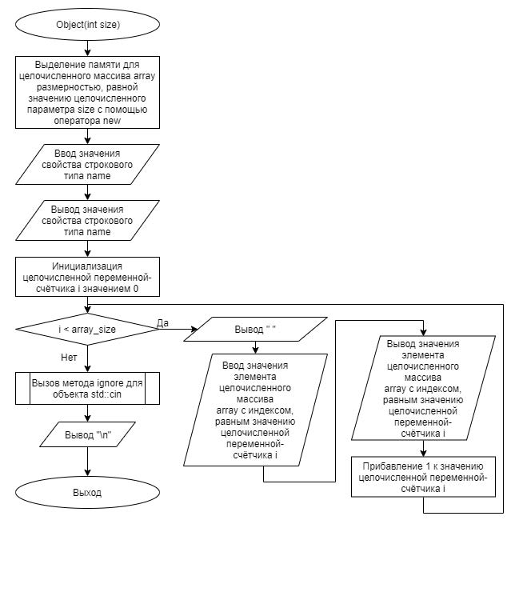

# Задание 4_1_1 | Дружественная функция

## Введение
Дружественная функция получает доступ к закрытым и защищенным элементам объекта класса, который установил дружбу. Объект передается в функции по параметру.

Одна из интерпретации (метафор), которую можно поставить в соответствии данной конструкции является пара: объект и инструмент для изменения (переналадки) характеристик объекта.

В описании класса объекта указывается, какая функция является дружественной согласно синтаксису:

`friend «тип возвращаемого значения» «наименование функции» ( «список параметров» );`

В списке параметров должен присутствовать параметр, который передает в функцию объект данного класса по значению, по указателю или по ссылке.

Функция может быть дружественным объектам нескольких классов.

## 1. Постановка задачи
Разработать систему, которая демонстрирует возможность использования дружественной функции. 

Спроектировать объект, с свойствами в закрытом доступе:

- целого типа, для хранения размерности массива;
- указатель на объект целого типа;
- строкового типа, для хранения наименования объекта.

С параметризированным конструктором. У конструктора есть параметр целого типа. Параметр передает (содержит) значение размерности целочисленного массива. В конструкторе создается целочисленный массив заданной размерности. Вводится и выводиться значение наименования объекта. Вводится и выводится значения элементов.

Объект имеет метод, который возвращает сумму элементов целочисленного массива.

В деструкторе, первоначально выводится значение наименования объекта, а далее значения элементов целочисленного массива и освобождается память, выделенная для массива. 

Спроектировать функцию, которая значения элементов массива одного объекта присвоит к элементам массива другого объекта.

Алгоритм конструирования и отработки системы:

1. Объявляется целочисленная переменная, для хранения значения количества объектов.
2. Объявляется целочисленная переменная, для хранения значения размерности массива.
3. Объявляется строковая переменная, для хранения наименования объекта.
4. Могут быть другие объявления.
5. Вводится значение количества объектов.
6. Вводится значение размерности массива.
7. В цикле создаются объекты, согласно введенному количеству.
8. Определяется значение суммы элементов для каждого объекта. Фиксируется объект, с первой минимальной суммой. Этот объект принимается за эталон.
9. В цикле, посредством последовательного вызова дружественной функции значения элементов массива эталонного объекта присваиваются элементам всех остальных объектов.
10. После завершения цикла, созданные объекты удаляются (уничтожаются).


### 1.1 Описание входных данных
**Первая строка:**  
```
«целое число, количество объектов»
```

**Вторая строка:**  
```
«целое число, размерность массива»
```

**Начиная с третей строки, имя очередного объекта и значения элементов массивов, согласно количеству объектов:**  
```
«строка» «целое число» «целое число» . . . «целое число»
```
*Количество целых чисел в этих строках больше или равно количеству размерности массива.*

**Пример ввода:**
```
5
5
obj_2 2 2 2 2 2 2 2
obj_3 3 3 3 3 3 3 3 3 3
obj_1 1 1 1 1 1
obj_4 4 4 4 4 4 4 4 4
obj_5 5 5 5 5 5
```

### 1.2 Описание выходных данных
**Первая строка:**  
```
«строка»  «целое число»  «целое число» . . . «целое число»
```  
*Имя объекта и значения элементов массива, согласно последовательности создания объектов.*

**Начиная со второй строки, построчно:**  
```
«имя объекта»: «целое число» «целое число» . . . «целое число»
```
*Имя объекта и значения элементов массива, согласно последовательности создания объектов.*

**Пример вывода:**
```
obj_2  2  2  2  2  2
obj_3  3  3  3  3  3
obj_1  1  1  1  1  1
obj_4  4  4  4  4  4
obj_5  5  5  5  5  5
obj_2: 1 1 1 1 1
obj_3: 1 1 1 1 1
obj_1: 1 1 1 1 1
obj_4: 1 1 1 1 1
obj_5: 1 1 1 1 1
```


## 2. Метод решения
*Используемые функции:*
- функция clone_array для присвоения значений элементов массива одного объекта элементам массива другого объекта
- функция main для реализации основного алгоритма программы

*Другие инструменты:*
- библиотека iostream
- библиотека string
- библиотека limits
- оператор new
- объекты стандартного потока ввода\вывода cin и cout;
- условный оператор if...else;
- оператор цикла со счётчиком for.

**Класс Object:**
- свойства/поля:
  - поле array_size:
    - описание назначения: хранение размерности массива
    - наименование: array_size
    - тип: int
    - модификатор доступа: private
  - поле array
    - описание назначения: указатель на объект целого типа
    - наименование: array
    - тип: int*
    - модификатор доступа: private
  - поле name
    - описание назначения: хранение наименования объекта
    - наименование: name
    - тип: std::string
    - модификатор доступа: private
- функционал:
  - метод get_array_sum: возврат суммы элементов целочисленного массива
  - метод Object — параметризированный конструктор
  - метод ~Object — деструктор


## 3. Описание алгоритмов

### 3.1 Алгоритм метода get_array_sum класса Object
Метод/функция: Метод  
Класс объекта: Object  
Модификатор доступа: public  
Имя: get_array_sum  
Параметры: нет  
Возвращаемое значение: void  
Функционал: возврат суммы элементов целочисленного массива  
<table>
    <thead>
        <tr>
            <th>№</th>
            <th>Предикат</th>
            <th>Действия</th>
            <th>№ перехода</th>
        </tr>
    </thead>
    <tbody>
        <tr>
            <td>1</td>
            <td></td>
            <td>Инициализация целочисленной переменной sum</td>
            <td>2</td>
        </tr>
        <tr>
            <td>2</td>
            <td></td>
            <td>Инициализация целочисленной переменной-счётчика i значением 0</td>
            <td>3</td>
        </tr>
        <tr>
            <td rowspan="2">3</td>
            <td>i < array_size</td>
            <td>Прибавление значения элемента целочисленного массива array с индексом i к значению целочисленной переменной sum</td>
            <td>4</td>
        </tr>
        <tr>
            <td></td>
            <td></td>
            <td>5</td>
        </tr>
        <tr>
            <td>4</td>
            <td></td>
            <td>Прибавление 1 к значению целочисленной переменной-счётчика i</td>
            <td>3</td>
        </tr>
        <tr>
            <td>5</td>
            <td></td>
            <td>Возврат значения целочисленной переменной sum</td>
            <td>0</td>
        </tr>
    </tbody>
</table>


### 3.2 Алгоритм конструктора класса Object
Метод/функция: Конструктор  
Класс объекта: Object  
Модификатор доступа: public  
Параметры: int size  
Функционал: параметризированный конструктор  
<table>
    <thead>
        <tr>
            <th>№</th>
            <th>Предикат</th>
            <th>Действия</th>
            <th>№ перехода</th>
        </tr>
    </thead>
    <tbody>
        <tr>
            <td>1</td>
            <td></td>
            <td>Выделение памяти для целочисленного массива array размерностью, равной значению целочисленного параметра size с помощью оператора new</td>
            <td>2</td>
        </tr>
        <tr>
            <td>2</td>
            <td></td>
            <td>Ввод значения свойства строкового типа name</td>
            <td>3</td>
        </tr>
        <tr>
            <td>3</td>
            <td></td>
            <td>Вывод значения свойства строкового типа name</td>
            <td>4</td>
        </tr>
        <tr>
            <td>4</td>
            <td></td>
            <td>Инициализация целочисленной переменной-счётчика i значением 0</td>
            <td>5</td>
        </tr>
        <tr>
            <td rowspan="2">5</td>
            <td>i < array_size</td>
            <td>Вывод " "</td>
            <td>6</td>
        </tr>
        <tr>
            <td></td>
            <td></td>
            <td>9</td>
        </tr>
        <tr>
            <td>6</td>
            <td></td>
            <td>Ввод значения элемента целочисленного массива array с индексом, равным значению целочисленной переменной-счётчика i</td>
            <td>7</td>
        </tr>
        <tr>
            <td>7</td>
            <td></td>
            <td>Вывод значения элемента целочисленного массива array с индексом, равным значению целочисленной переменной-счётчика i</td>
            <td>8</td>
        </tr>
        <tr>
            <td>8</td>
            <td></td>
            <td>Прибавление 1 к значению целочисленной
            переменной-счётчика i</td>
            <td>5</td>
        </tr>
        <tr>
            <td>9</td>
            <td></td>
            <td>Вызов метода ignore для объекта std::cin</td>
            <td>10</td>
        </tr>
        <tr>
            <td>10</td>
            <td></td>
            <td>Вывод "\n"</td>
            <td>0</td>
        </tr>
    </tbody>
</table>

### 3.3 Алгоритм деструктора класса Object
Метод/функция: Деструктор  
Класс объекта: Object  
Модификатор доступа: public  
Параметры: нет  
Функционал: деструктор  
<table>
    <thead>
        <tr>
            <th>№</th>
            <th>Предикат</th>
            <th>Действия</th>
            <th>№ перехода</th>
        </tr>
    </thead>
    <tbody>
        <tr>
            <td>1</td>
            <td></td>
            <td>Вывод <значение переменной строкового типа name>, ":"</td>
            <td>2</td>
        </tr>
        <tr>
            <td>2</td>
            <td></td>
            <td>Инициализация целочисленной переменной-счётчика i значением 0</td>
            <td>3</td>
        </tr>
        <tr>
            <td rowspan="2">3</td>
            <td>i < array_size</td>
            <td>Вывод " ", значение элемента целочисленного массива array с индексом, равным значению целочисленной переменной-счётчика i</td>
            <td>4</td>
        </tr>
        <tr>
            <td></td>
            <td>Вывод "\n"</td>
            <td>4</td>
        </tr>
        <tr>
            <td>4</td>
            <td></td>
            <td>Прибавление 1 к значению целочисленной переменной-счётчика i</td>
            <td>3</td>
        </tr>
        <tr>
            <td>5</td>
            <td></td>
            <td>Освобождение памяти, выделенной для целочисленного массива array</td>
            <td>0</td>
        </tr>
    </tbody>
</table>

### 3.4 Алгоритм функции clone_array
Метод/функция: Функция  
Имя: clone_array  
Параметры: Object* source, Object* target  
Возвращаемое значение: void  
Функционал: присвоение значений элементов массива одного объекта элементам массива другого объекта  
<table>
    <thead>
        <tr>
            <th>№</th>
            <th>Предикат</th>
            <th>Действия</th>
            <th>№ перехода</th>
        </tr>
    </thead>
    <tbody>
        <tr>
            <td>1</td>
            <td></td>
            <td>Инициализация целочисленной переменной- счётчика i значением 0</td>
            <td>2</td>
        </tr>
        <tr>
            <td rowspan="2">2</td>
            <td>i < source->array_size</td>
            <td>Присвоение элементу целочисленного массива
            array с индексом, равным значению
            целочисленной переменной-счётчика i, являющегося членом объекта, адрес которого
            является значением указателя target значения,
            равного элементу целочисленного массива array с
            индексом, равным значению целочисленной
            переменной-счётчика i, являющегося членом
            объекта, адрес которого является значением
            указателя source</td>
            <td>3</td>
        </tr>
        <tr>
            <td></td>
            <td></td>
            <td>0</td>
        </tr>
        <tr>
            <td>3</td>
            <td></td>
            <td>Прибавление 1 к значению целочисленной
            переменной-счётчика i</td>
            <td>2</td>
        </tr>
    </tbody>
</table>

### 3.5 Алгоритм функции main
Метод/функция: Функция  
Имя: main  
Параметры: void  
Возвращаемое значение: int  
Функционал: определение точки входа программы  
<table>
    <thead>
        <tr>
            <th>№</th>
            <th>Предикат</th>
            <th>Действия</th>
            <th>№ перехода</th>
        </tr>
    </thead>
    <tbody>
        <tr>
            <td>1</td>
            <td></td>
            <td>Инициализация целочисленной переменной
            number_of_objects значением 0</td>
            <td>2</td>
        </tr>
        <tr>
            <td>2</td>
            <td></td>
            <td>Инициализация целочисленной переменной
            array_size значением 0</td>
            <td>3</td>
        </tr>
        <tr>
            <td>3</td>
            <td></td>
            <td>Инициализация переменной строкового типа
            object_name значением ""</td>
            <td>4</td>
        </tr>
        <tr>
            <td>4</td>
            <td></td>
            <td>Ввод значения целочисленной переменной
            number_of_objects</td>
            <td>5</td>
        </tr>
        <tr>
            <td>5</td>
            <td></td>
            <td>Ввод значения целочисленной переменной array_size</td>
            <td>6</td>
        </tr>
        <tr>
            <td>6</td>
            <td></td>
            <td>Объявление массива указателей на объект класса
            Object objects размерностью, равной значению
            целочисленной переменной number_of_objects</td>
            <td>7</td>
        </tr>
        <tr>
            <td>7</td>
            <td></td>
            <td>Инициализация целочисленной переменной-
            счётчика i значением 0</td>
            <td>8</td>
        </tr>
        <tr>
            <td rowspan="2">8</td>
            <td>i < number_of_objects</td>
            <td>Создание объекта класса Object посредством
            параметризированного конструктора с передачей
            значения целочисленной переменной array_size в
            качестве параметра и присвоение адреса
            созданного объекта элементу массива указателей
            на объект класса Object objects с индексом,
            равным значению целочисленной переменной-
            счётчика i</td>
            <td>9</td>
        </tr>
        <tr>
            <td></td>
            <td></td>
            <td>10</td>
        </tr>
        <tr>
            <td>9</td>
            <td></td>
            <td>Прибавление 1 к значению целочисленной
            переменной-счётчика i</td>
            <td>8</td>
        </tr>
        <tr>
            <td>10</td>
            <td></td>
            <td>Инициализация указателя на объект класса Object
            reference_object значением, равным значению
            элемента массива указателей на объект класса
            Object objects с индексом, равным 0</td>
            <td>11</td>
        </tr>
        <tr>
            <td>11</td>
            <td></td>
            <td>Инициализация целочисленной переменной-
            счётчика i значением 0</td>
            <td>12</td>
        </tr>
        <tr>
            <td rowspan="2">12</td>
            <td>i < number_of_objects</td>
            <td></td>
            <td>13</td>
        </tr>
        <tr>
            <td></td>
            <td></td>
            <td>15</td>
        </tr>
        <tr>
            <td rowspan="2">13</td>
            <td>Значение, полученное в
результате вызова метода
get_array_sum для элемента
массива указателей на
объект класса Object objects синдексом, равным значению
целочисленной переменной-
счётчика i < значение,
полученное в результате
вызова метода get_array_sum
для объекта, адрес которого
является значением
указателя на объект класса
Object reference_object</td>
            <td>Присвоение указателю на объект класса Object
            reference_object значения, равного значению
            элемента массива указателей на объект класса
            Object objects с индексом, равным значению целочисленной переменной-счётчика i</td>
            <td>14</td>
        </tr>
        <tr>
            <td></td>
            <td></td>
            <td>14</td>
        </tr>
        <tr>
            <td>14</td>
            <td></td>
            <td>Прибавление 1 к значению целочисленной
            переменной-счётчика i</td>
            <td>12</td>
        </tr>
        <tr>
            <td>15</td>
            <td></td>
            <td>Инициализация целочисленной переменной-счётчика i значением 0</td>
            <td>16</td>
        </tr>
        <tr>
            <td rowspan="2">16</td>
            <td>i < number_of_objects</td>
            <td>Вызов функции clone_array с передачей значения указателя на объект класса Object reference_object в качестве первого параметра, и значения элемента массива указателей на объект класса Object objects с индексом, равным значению целочисленной переменной-счётчика i в качестве второго параметра</td>
            <td>17</td>
        </tr>
        <tr>
            <td></td>
            <td></td>
            <td>18</td>
        </tr>
        <tr>
            <td>17</td>
            <td></td>
            <td>Прибавление 1 к значению целочисленной переменной-счётчика i</td>
            <td>16</td>
        </tr>
        <tr>
            <td>18</td>
            <td></td>
            <td>Инициализация целочисленной переменной-счётчика i значением 0</td>
            <td>19</td>
        </tr>
        <tr>
            <td rowspan="2">19</td>
            <td>i < number_of_objects</td>
            <td>Освобождение памяти, выделенной для элемента массива указателей на объект класса Object objects с индексом, равным значению целочисленной переменной-счётчика i</td>
            <td>20</td>
        </tr>
        <tr>
            <td></td>
            <td></td>
            <td>0</td>
        </tr>
        <tr>
            <td>20</td>
            <td></td>
            <td>Прибавление 1 к значению целочисленной переменной-счётчика i</td>
            <td>19</td>
        </tr>
    </tbody>
</table>


## 4. Блок-схемы алгоритмов




## 5. Код программы

### 5.1 Файл Object.h
```cpp
#ifndef __OBJECT__H
#define __OBJECT__H

#include <string>
#include <limits>
#include <iostream>


class Object
{
friend void clone_array(Object* source, Object* target);

public:
    int get_array_sum();
    Object(int size);
    ~Object();

private:
    int array_size;
    int* array;
    std::string name;
};


#endif
```

### 5.2 Файл Object.cpp
```cpp
#include "Object.h"


int Object::get_array_sum()
{
    int sum = 0;
    for(int i = 0; i < array_size; i++)
    {
        sum += array[i];
    }
    return sum;
}

Object::Object(int size): array_size{size}
{
    array = new int[size];

    std::cin >> name;
    std::cout << name;

    for(int i = 0; i < array_size; i++)
    {
        std::cout << "  ";
        std::cin >> array[i];
        std::cout << array[i];
    }
    std::cin.ignore(std::numeric_limits<std::streamsize>::max(), '\n');
    std::cout << std::endl;
}

Object::~Object()
{
    std::cout << name << ":";
    for(int i = 0; i < array_size; i++)
    {
        std::cout << " " << array[i];
    }
    std::cout << std::endl;
    
    delete array;
}
```

### 5.3 Файл main.cpp
```cpp
#include "Object.h"


void clone_array(Object* source, Object* target)
{
    for(int i = 0; i < source->array_size; i++)
    {
        target->array[i] = source->array[i];
    }
}

int main()
{
    int number_of_objects = 0;
    int array_size = 0;
    std::string object_name = "";

    std::cin >> number_of_objects;
    std::cin >> array_size;

    Object** objects = new Object*[number_of_objects];

    for(int i = 0; i < number_of_objects; i++)
    {
        objects[i] = new Object(array_size);
    }

    Object* reference_object = objects[0];

    for(int i = 0; i < number_of_objects; i++)
    {
        if(objects[i]->get_array_sum() < reference_object->get_array_sum())
        {
            reference_object = objects[i];
        }
    }

    for(int i = 0; i < number_of_objects; i++)
    {
        clone_array(reference_object, objects[i]);
    }

    for(int i = 0; i < number_of_objects; i++)
    {
        delete objects[i];
    }

    return 0;
}
```

## 6. Тестирование
<table>
    <thead>
        <tr>
            <th>Входные данные</th>
            <th>Ожидаемые выходные данные</th>
            <th>Фактические выходные данные</th>
        </tr>
    </thead>
    <tbody>
        <tr>
            <td>
                <pre>
5
5
obj_2 2 2 2 2 2 2 2
obj_3 3 3 3 3 3 3 3
3 3
obj_1 1 1 1 1 1
obj_4 4 4 4 4 4 4 4
4
obj_5 5 5 5 5 5
                </pre>
            </td>
            <td>
                <pre>
obj_2  2  2  2  2  2
obj_3  3  3  3  3  3
obj_1  1  1  1  1  1
obj_4  4  4  4  4  4
obj_5  5  5  5  5  5
obj_2: 1 1 1 1 1
obj_3: 1 1 1 1 1
obj_1: 1 1 1 1 1
obj_4: 1 1 1 1 1
obj_5: 1 1 1 1 1
                </pre>
            </td>
            <td>
                <pre>
obj_2  2  2  2  2  2
obj_3  3  3  3  3  3
obj_1  1  1  1  1  1
obj_4  4  4  4  4  4
obj_5  5  5  5  5  5
obj_2: 1 1 1 1 1
obj_3: 1 1 1 1 1
obj_1: 1 1 1 1 1
obj_4: 1 1 1 1 1
obj_5: 1 1 1 1 1
                </pre>
            </td>
        </tr>
    </tbody>
</table>
