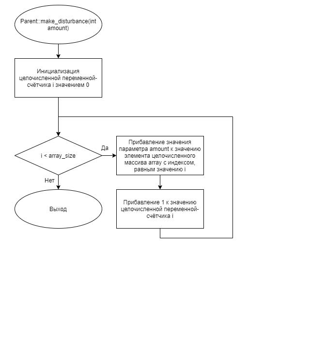
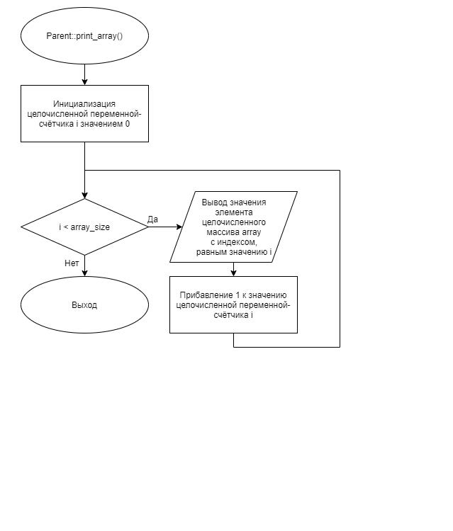
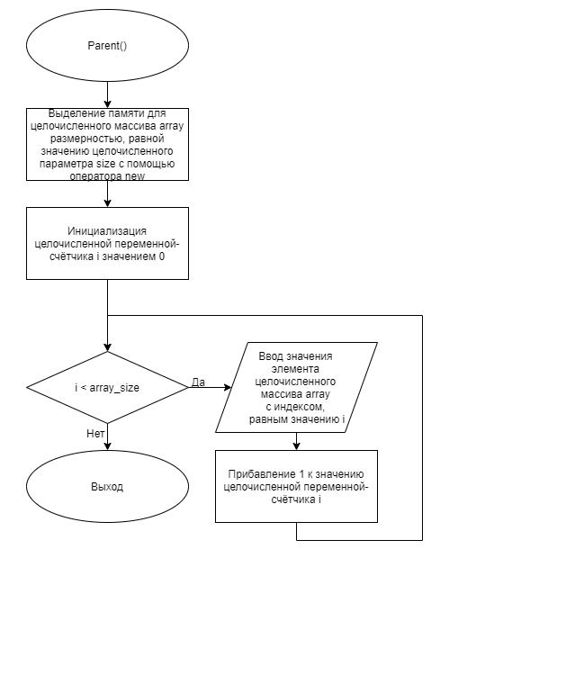
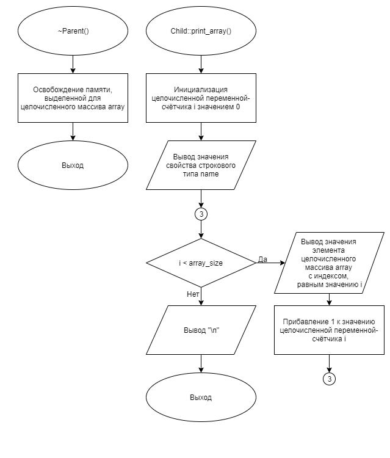
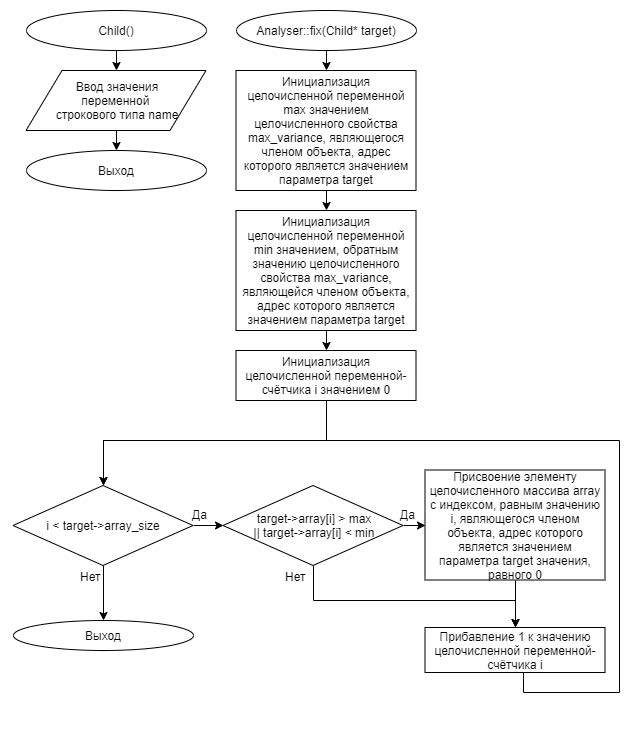
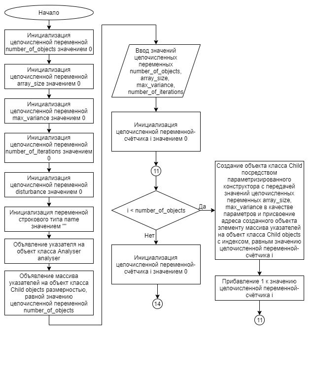
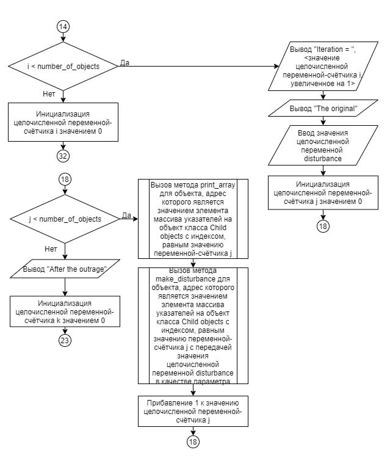
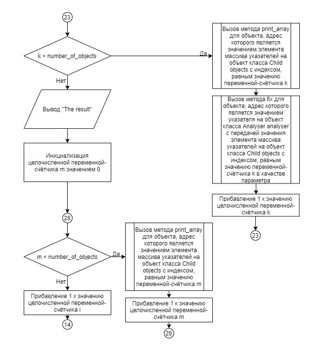
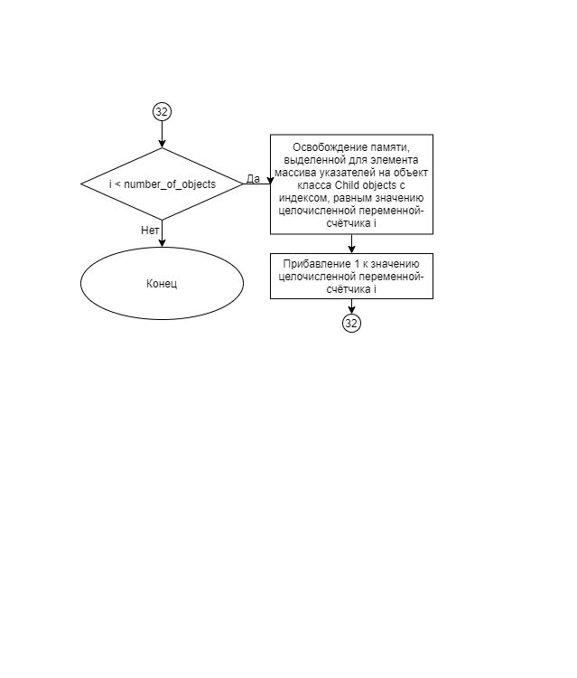

# Задание 4_2_1 | Дружественный класс

## Введение
Объект дружественного класса получает доступ к зарытым и защищенным элементам объекта класса, c которым установил дружбу.

Одна из интерпретации (метафор), которую можно поставить в соответствии данной конструкции является пара: основной объект и инструмент («вспомогательный» объект) для мониторинга, анализа и настройки.

В описании класса объекта указывается, объект какого класса является дружественным согласно синтаксису:
`friend «наименование класса»;`

## 1. Постановка задачи
Разработать систему, которая демонстрирует возможность использования объекта дружественного класса. 

Система состоит из множества однотипных объектов. Объекты содержат характеристику, на которую влияет внешнее возмущение, что приводит к отклонению части значений за пределы допустимой нормы. В составе системы входит инструмент, который периодически анализирует состояние каждого объекта и при обнаружении недопустимых отклонений проводит необходимые корректировки, для восстановления режима нормального функционирования объектов.

Спроектировать объект, с свойствами в закрытом доступе:
- целого типа, для хранения размерности массива;
- целого типа, для хранения величины допустимого отклонения;
- указатель на объект целого типа.

С параметризированным конструктором. У конструктора есть параметр целого типа. Параметр передает (содержит) значение размерности целочисленного массива. У конструктора есть параметр целого типа. Параметр передает (содержит) значение величины допустимого отклонения. В конструкторе: фиксируются значения размерности массива и величины допустимого отклонения; создается целочисленный массив заданной размерности; вводится значения элементов массива. Класс данного объекта является родительским. Имеется функционал (методы) в открытом доступе:
- реализует возмущение значений элементов целочисленного массива. Метод имеет одни целочисленный параметр, который содержит величину возмущения для элементов массива. Каждому элементу массива добавляется величина возмущения;
- реализует вывод значений элементов массива

В деструкторе освобождается память, выделенная для массива.


Спроектировать производный объект, на базе родительского объекта. У объекта в закрытом доступе имеется свойство:
- строкового типа, для хранения наименования объекта.

С параметризированным конструктором. У конструктора есть параметр целого типа. Параметр передает (содержит) значение размерности целочисленного массива. У конструктора есть параметр целого типа. Параметр передает (содержит) значение величины допустимого отклонения. В реализации конструктора вводится значение наименования объекта.

Имеется функционал (метод) в открытом доступе, который с новой строки выводит наименование объекта и значения элементов массива.

Спроектировать объект, который анализирует состояние производных объектов. Проверяет значения всех элементов массива. Если значение выходит за рамки интервала допустимости, то значение элемента меняет на ноль. Для этого у объекта имеется соответствующий метод. Допустимым интервалом является отрицательное и положительного значение величины отклонения. Например: [-5, 5].


Алгоритм конструирования и отработки системы:
1. Объявляются целочисленные переменные для хранения значений: количества объектов; размерности массива; величины допустимого отклонения; количество итераций.
2. Объявляется строковая переменная, для хранения наименования объекта.
3. Могут быть другие объявления.
4. Вводятся значения: количество объектов; размерность массива; величины допустимого отклонения; количество итераций.
5. В цикле создаются производные объекты, согласно введенному количеству.
6. Запускается цикл согласно количеству итераций.
    6.1. С новой строки выводится: Iteration = «номер итерации»  
    6.2. С новой строки выводится: The original  
    6.3. Для каждого объекта выводиться значения элементов массива.  
    6.4. Вводится значение величины возмущения.  
    6.5. Для каждого объекта отрабатывает метод возмущения.  
    6.6. С новой строки выводится: After the outrage  
    6.7. Посредством объекта анализа и корректировки состояния производного объекта, проверяется и приводиться в нормальный режим работы каждый производный объект.  
    6.8. С новой строки выводится: The result  
    6.9. Для каждого объекта выводиться значения элементов массива.  
7. После завершения цикла итераций, созданные производные объекты удаляются (уничтожаются).


### 1.1 Описание входных данных
**Первая строка:**  
```
«целое число, количество объектов»
```

**Вторая строка:**  
```
«целое число, размерность массива»
```

**Третья строка:**  
```
«целое число, величина допустимого отклонения»
```

**Четвертая строка:**  
```
«целое число, количество итераций»
```

**Начиная с пятой строки, значения элементов массивов и имя очередного объекта, согласно количеству объектов:**  
```
«целое число» «целое число» . . . «целое число» «строка»
```

**Далее, построчно значения величины возмущения, согласно количества итерации:**
```
«целое число, значение величины возмущения»
```

**Пример ввода:**
```
2
5
6
4
1 -1 1 -1 1 object_1
-2 2 -2 2 -2 object_2
3
4
2
-7
```

### 1.2 Описание выходных данных
**В процессе каждой итерации производится вывод:**  
```
Iteration = «номер итерации»
The original
«имя объекта»  «целое число»  «целое число» . . . «целое число»
```  
*Имя объекта и значения элементов массива, согласно последовательности создания объектов.*

```
After the outrage
«имя объекта»  «целое число»  «целое число» . . . «целое число»
```
*Имя объекта и значения элементов массива, согласно последовательности создания объектов.*

```
The result
«имя объекта»  «целое число»  «целое число» . . . «целое число»
```
*Имя объекта и значения элементов массива, согласно последовательности создания объектов.*

**Пример вывода:**
```
Iteration = 1
The original
object_1  1  -1  1  -1  1
object_2  -2  2  -2  2  -2
After the outrage
object_1  4  2  4  2  4
object_2  1  5  1  5  1
The result
object_1  4  2  4  2  4
object_2  1  5  1  5  1
Iteration = 2
The original
object_1  4  2  4  2  4
object_2  1  5  1  5  1
After the outrage
object_1  8  6  8  6  8
object_2  5  9  5  9  5
The result
object_1  0  6  0  6  0
object_2  5  0  5  0  5
Iteration = 3
The original
object_1  0  6  0  6  0
object_2  5  0  5  0  5
After the outrage
object_1  2  8  2  8  2
object_2  7  2  7  2  7
The result
object_1  2  0  2  0  2
object_2  0  2  0  2  0
Iteration = 4
The original
object_1  2  0  2  0  2
object_2  0  2  0  2  0
After the outrage
object_1  -5  -7  -5  -7  -5
object_2  -7  -5  -7  -5  -7
The result
object_1  -5  0  -5  0  -5
object_2  0  -5  0  -5  0
```


## 2. Метод решения
*Используемые объекты:*
- объект analyser класса Analyser предназначен для анализа состояния производных объектов

*Используемые функции:*
- функция main для реализации основного алгоритма программы

*Другие инструменты:*
- библиотека iostream
- библиотека string
- библиотека limits
- оператор new
- объекты стандартного потока ввода\вывода cin и cout;
- условный оператор if...else;
- оператор цикла со счётчиком for.

**Класс Parent:**
- свойства/поля:
  - поле array_size:
    - описание назначения: хранение размерности массива
    - наименование: array_size
    - тип: int
    - модификатор доступа: private
  - поле max_variance
    - описание назначения: хранение величины допустимого отклонения
    - наименование: max_variance
    - тип: int
    - модификатор доступа: private
  - поле array
    - описание назначения: указатель на объект целочисленного типа
    - наименование: array
    - тип: int*
    - модификатор доступа: private
- функционал:
  - метод make_disturbance: реализует возмущение значений элементов целочисленного массива
  - метод print_array: вывод значений элементов массива
  - метод Parent — параметризированный конструктор
  - метод ~Parent — деструктор

**Класс Child:**
- свойства/поля:
  - поле name
    - описание назначения: хранение наименования объекта
    - наименование: name
    - тип: std::string
    - модификатор доступа: private
- функционал:
  - метод print_array: вывод значений элементов массива
  - метод Child — параметризированный конструктор

**Класс Analyser:**
- функционал:
  - метод fix: анализ состояния производных объектов


## 3. Описание алгоритмов

### 3.1 Алгоритм метода make_disturbance класса Parent
Метод/функция: Метод  
Класс объекта: Parent  
Модификатор доступа: public  
Имя: make_disturbance  
Параметры: int amount  
Возвращаемое значение: void  
Функционал: реализует возмущение значений элементов целочисленногомассива  
<table>
    <thead>
        <tr>
            <th>№</th>
            <th>Предикат</th>
            <th>Действия</th>
            <th>№ перехода</th>
        </tr>
    </thead>
    <tbody>
        <tr>
            <td>1</td>
            <td></td>
            <td>Инициализация целочисленной переменной sum</td>
            <td>2</td>
        </tr>
        <tr>
            <td>2</td>
            <td></td>
            <td>Инициализация целочисленной переменной-счётчика i значением 0</td>
            <td>3</td>
        </tr>
        <tr>
            <td rowspan="2">3</td>
            <td>i < array_size</td>
            <td>Прибавление значения элемента целочисленного массива array с индексом i к значению целочисленной переменной sum</td>
            <td>4</td>
        </tr>
        <tr>
            <td></td>
            <td></td>
            <td>5</td>
        </tr>
        <tr>
            <td>4</td>
            <td></td>
            <td>Прибавление 1 к значению целочисленной переменной-счётчика i</td>
            <td>3</td>
        </tr>
        <tr>
            <td>5</td>
            <td></td>
            <td>Возврат значения целочисленной переменной sum</td>
            <td>0</td>
        </tr>
    </tbody>
</table>


### 3.2 Алгоритм конструктора класса Object
Метод/функция: Конструктор  
Класс объекта: Object  
Модификатор доступа: public  
Параметры: int size  
Функционал: параметризированный конструктор  
<table>
    <thead>
        <tr>
            <th>№</th>
            <th>Предикат</th>
            <th>Действия</th>
            <th>№ перехода</th>
        </tr>
    </thead>
    <tbody>
        <tr>
            <td>1</td>
            <td></td>
            <td>Выделение памяти для целочисленного массива array размерностью, равной значению целочисленного параметра size с помощью оператора new</td>
            <td>2</td>
        </tr>
        <tr>
            <td>2</td>
            <td></td>
            <td>Ввод значения свойства строкового типа name</td>
            <td>3</td>
        </tr>
        <tr>
            <td>3</td>
            <td></td>
            <td>Вывод значения свойства строкового типа name</td>
            <td>4</td>
        </tr>
        <tr>
            <td>4</td>
            <td></td>
            <td>Инициализация целочисленной переменной-счётчика i значением 0</td>
            <td>5</td>
        </tr>
        <tr>
            <td rowspan="2">5</td>
            <td>i < array_size</td>
            <td>Вывод " "</td>
            <td>6</td>
        </tr>
        <tr>
            <td></td>
            <td></td>
            <td>9</td>
        </tr>
        <tr>
            <td>6</td>
            <td></td>
            <td>Ввод значения элемента целочисленного массива array с индексом, равным значению целочисленной переменной-счётчика i</td>
            <td>7</td>
        </tr>
        <tr>
            <td>7</td>
            <td></td>
            <td>Вывод значения элемента целочисленного массива array с индексом, равным значению целочисленной переменной-счётчика i</td>
            <td>8</td>
        </tr>
        <tr>
            <td>8</td>
            <td></td>
            <td>Прибавление 1 к значению целочисленной
            переменной-счётчика i</td>
            <td>5</td>
        </tr>
        <tr>
            <td>9</td>
            <td></td>
            <td>Вызов метода ignore для объекта std::cin</td>
            <td>10</td>
        </tr>
        <tr>
            <td>10</td>
            <td></td>
            <td>Вывод "\n"</td>
            <td>0</td>
        </tr>
    </tbody>
</table>

### 3.3 Алгоритм деструктора класса Object
Метод/функция: Деструктор  
Класс объекта: Object  
Модификатор доступа: public  
Параметры: нет  
Функционал: деструктор  
<table>
    <thead>
        <tr>
            <th>№</th>
            <th>Предикат</th>
            <th>Действия</th>
            <th>№ перехода</th>
        </tr>
    </thead>
    <tbody>
        <tr>
            <td>1</td>
            <td></td>
            <td>Вывод <значение переменной строкового типа name>, ":"</td>
            <td>2</td>
        </tr>
        <tr>
            <td>2</td>
            <td></td>
            <td>Инициализация целочисленной переменной-счётчика i значением 0</td>
            <td>3</td>
        </tr>
        <tr>
            <td rowspan="2">3</td>
            <td>i < array_size</td>
            <td>Вывод " ", значение элемента целочисленного массива array с индексом, равным значению целочисленной переменной-счётчика i</td>
            <td>4</td>
        </tr>
        <tr>
            <td></td>
            <td>Вывод "\n"</td>
            <td>4</td>
        </tr>
        <tr>
            <td>4</td>
            <td></td>
            <td>Прибавление 1 к значению целочисленной переменной-счётчика i</td>
            <td>3</td>
        </tr>
        <tr>
            <td>5</td>
            <td></td>
            <td>Освобождение памяти, выделенной для целочисленного массива array</td>
            <td>0</td>
        </tr>
    </tbody>
</table>

### 3.4 Алгоритм функции clone_array
Метод/функция: Функция  
Имя: clone_array  
Параметры: Object* source, Object* target  
Возвращаемое значение: void  
Функционал: присвоение значений элементов массива одного объекта элементам массива другого объекта  
<table>
    <thead>
        <tr>
            <th>№</th>
            <th>Предикат</th>
            <th>Действия</th>
            <th>№ перехода</th>
        </tr>
    </thead>
    <tbody>
        <tr>
            <td>1</td>
            <td></td>
            <td>Инициализация целочисленной переменной- счётчика i значением 0</td>
            <td>2</td>
        </tr>
        <tr>
            <td rowspan="2">2</td>
            <td>i < source->array_size</td>
            <td>Присвоение элементу целочисленного массива
            array с индексом, равным значению
            целочисленной переменной-счётчика i, являющегося членом объекта, адрес которого
            является значением указателя target значения,
            равного элементу целочисленного массива array с
            индексом, равным значению целочисленной
            переменной-счётчика i, являющегося членом
            объекта, адрес которого является значением
            указателя source</td>
            <td>3</td>
        </tr>
        <tr>
            <td></td>
            <td></td>
            <td>0</td>
        </tr>
        <tr>
            <td>3</td>
            <td></td>
            <td>Прибавление 1 к значению целочисленной
            переменной-счётчика i</td>
            <td>2</td>
        </tr>
    </tbody>
</table>

### 3.5 Алгоритм функции main
Метод/функция: Функция  
Имя: main  
Параметры: void  
Возвращаемое значение: int  
Функционал: определение точки входа программы  
<table>
    <thead>
        <tr>
            <th>№</th>
            <th>Предикат</th>
            <th>Действия</th>
            <th>№ перехода</th>
        </tr>
    </thead>
    <tbody>
        <tr>
            <td>1</td>
            <td></td>
            <td>Инициализация целочисленной переменной
            number_of_objects значением 0</td>
            <td>2</td>
        </tr>
        <tr>
            <td>2</td>
            <td></td>
            <td>Инициализация целочисленной переменной
            array_size значением 0</td>
            <td>3</td>
        </tr>
        <tr>
            <td>3</td>
            <td></td>
            <td>Инициализация переменной строкового типа
            object_name значением ""</td>
            <td>4</td>
        </tr>
        <tr>
            <td>4</td>
            <td></td>
            <td>Ввод значения целочисленной переменной
            number_of_objects</td>
            <td>5</td>
        </tr>
        <tr>
            <td>5</td>
            <td></td>
            <td>Ввод значения целочисленной переменной array_size</td>
            <td>6</td>
        </tr>
        <tr>
            <td>6</td>
            <td></td>
            <td>Объявление массива указателей на объект класса
            Object objects размерностью, равной значению
            целочисленной переменной number_of_objects</td>
            <td>7</td>
        </tr>
        <tr>
            <td>7</td>
            <td></td>
            <td>Инициализация целочисленной переменной-
            счётчика i значением 0</td>
            <td>8</td>
        </tr>
        <tr>
            <td rowspan="2">8</td>
            <td>i < number_of_objects</td>
            <td>Создание объекта класса Object посредством
            параметризированного конструктора с передачей
            значения целочисленной переменной array_size в
            качестве параметра и присвоение адреса
            созданного объекта элементу массива указателей
            на объект класса Object objects с индексом,
            равным значению целочисленной переменной-
            счётчика i</td>
            <td>9</td>
        </tr>
        <tr>
            <td></td>
            <td></td>
            <td>10</td>
        </tr>
        <tr>
            <td>9</td>
            <td></td>
            <td>Прибавление 1 к значению целочисленной
            переменной-счётчика i</td>
            <td>8</td>
        </tr>
        <tr>
            <td>10</td>
            <td></td>
            <td>Инициализация указателя на объект класса Object
            reference_object значением, равным значению
            элемента массива указателей на объект класса
            Object objects с индексом, равным 0</td>
            <td>11</td>
        </tr>
        <tr>
            <td>11</td>
            <td></td>
            <td>Инициализация целочисленной переменной-
            счётчика i значением 0</td>
            <td>12</td>
        </tr>
        <tr>
            <td rowspan="2">12</td>
            <td>i < number_of_objects</td>
            <td></td>
            <td>13</td>
        </tr>
        <tr>
            <td></td>
            <td></td>
            <td>15</td>
        </tr>
        <tr>
            <td rowspan="2">13</td>
            <td>Значение, полученное в
результате вызова метода
get_array_sum для элемента
массива указателей на
объект класса Object objects синдексом, равным значению
целочисленной переменной-
счётчика i < значение,
полученное в результате
вызова метода get_array_sum
для объекта, адрес которого
является значением
указателя на объект класса
Object reference_object</td>
            <td>Присвоение указателю на объект класса Object
            reference_object значения, равного значению
            элемента массива указателей на объект класса
            Object objects с индексом, равным значению целочисленной переменной-счётчика i</td>
            <td>14</td>
        </tr>
        <tr>
            <td></td>
            <td></td>
            <td>14</td>
        </tr>
        <tr>
            <td>14</td>
            <td></td>
            <td>Прибавление 1 к значению целочисленной
            переменной-счётчика i</td>
            <td>12</td>
        </tr>
        <tr>
            <td>15</td>
            <td></td>
            <td>Инициализация целочисленной переменной-счётчика i значением 0</td>
            <td>16</td>
        </tr>
        <tr>
            <td rowspan="2">16</td>
            <td>i < number_of_objects</td>
            <td>Вызов функции clone_array с передачей значения указателя на объект класса Object reference_object в качестве первого параметра, и значения элемента массива указателей на объект класса Object objects с индексом, равным значению целочисленной переменной-счётчика i в качестве второго параметра</td>
            <td>17</td>
        </tr>
        <tr>
            <td></td>
            <td></td>
            <td>18</td>
        </tr>
        <tr>
            <td>17</td>
            <td></td>
            <td>Прибавление 1 к значению целочисленной переменной-счётчика i</td>
            <td>16</td>
        </tr>
        <tr>
            <td>18</td>
            <td></td>
            <td>Инициализация целочисленной переменной-счётчика i значением 0</td>
            <td>19</td>
        </tr>
        <tr>
            <td rowspan="2">19</td>
            <td>i < number_of_objects</td>
            <td>Освобождение памяти, выделенной для элемента массива указателей на объект класса Object objects с индексом, равным значению целочисленной переменной-счётчика i</td>
            <td>20</td>
        </tr>
        <tr>
            <td></td>
            <td></td>
            <td>0</td>
        </tr>
        <tr>
            <td>20</td>
            <td></td>
            <td>Прибавление 1 к значению целочисленной переменной-счётчика i</td>
            <td>19</td>
        </tr>
    </tbody>
</table>


## 4. Блок-схемы алгоритмов











## 5. Код программы

### 5.1 Файл Parent.h
```cpp
#ifndef __PARENT__H
#define __PARENT__H

#include <iostream>


class Parent
{
friend class Child;
friend class Analyser;

public:
    void make_disturbance(int amount);
    void print_array();

    Parent(int size, int variance);
    ~Parent();

private:
    int array_size = 0;
    int max_variance = 0;
    int* array;
};


#endif
```

### 5.2 Файл Parent.cpp
```cpp
#include "Parent.h"


void Parent::make_disturbance(int amount)
{
    for(int i = 0; i < array_size; i++)
    {
        array[i] += amount;
    }
}

void Parent::print_array()
{
    for(int i = 0; i < array_size; i++)
    {
        std::cout << array[i] << std::endl;
    }
}

Parent::Parent(int size, int variance): array_size{size}, max_variance{variance}
{
    array = new int[size];
    for(int i = 0; i < size; i++)
    {
        std::cin >> array[i];
    }
}

Parent::~Parent()
{
    delete array;
}
```

### 5.3 Файл Child.h
```cpp
#ifndef __CHILD__H
#define __CHILD__H

#include "Parent.h"
#include <string>


class Child : public Parent
{
friend class Analyser;

public:
    void print_array();

    Child(int size, int variance);
    ~Child();

private:
    std::string name;
};


#endif
```

### 5.4 Файл Child.cpp
```cpp
#include "Child.h"

    
void Child::print_array()
{
    std::cout << name;
    for(int i = 0; i < array_size; i++)
    {
        std::cout << "  " << array[i];
    }
    std::cout << std::endl;
}

Child::Child(int size, int variance): Parent(size, variance)
{
    std::cin >> name;
}
```

### 5.5 Файл Analyser.h
```cpp
#ifndef __ANALYSER__H
#define __ANALYSER__H

#include "Child.h"


class Analyser
{
public:
    void fix(Child* target);
};


#endif
```

### 5.6 Файл Analyser.cpp
```cpp
#include "Analyser.h"


void Analyser::fix(Child* target)
{
    int max = target->max_variance;
    int min = -target->max_variance;
    
    for(int i = 0; i < target->array_size; i++)
    {
        if(target->array[i] > max || target->array[i] < min)
        {
            target->array[i] = 0;
        }
    }
}
```

### 5.7 Файл main.cpp
```cpp
#include "Parent.h"
#include "Child.h"
#include "Analyser.h"


int main()
{
    int number_of_objects = 0;
    int array_size = 0;
    int max_variance = 0;
    int number_of_iterations = 0;
    int disturbance = 0;
    std::string name = "";
    
    Analyser* analyser = new Analyser();
    Child** objects = new Child*[number_of_objects];
    
    std::cin >> number_of_objects >>
                array_size >>
                max_variance >>
                number_of_iterations;
    
    for(int i = 0; i < number_of_objects; i++)
    {
        objects[i] = new Child(array_size, max_variance);
    }
    
    for(int i = 0; i < number_of_iterations; i++)
    {
        std::cout << "Iteration = " << i+1 << std::endl;
        std::cout << "The original" << std::endl;
        std::cin >> disturbance;
        for(int i = 0; i < number_of_objects; i++)
        {
            objects[i]->print_array();
            objects[i]->make_disturbance(disturbance);
        }
        
        std::cout << "After the outrage" << std::endl;
        for(int i = 0; i < number_of_objects; i++)
        {
            objects[i]->print_array();
            analyser->fix(objects[i]);
        }
        
        std::cout << "The result" << std::endl;
        for(int i = 0; i < number_of_objects; i++)
        {
            objects[i]->print_array();
        }
    }

    for(int i = 0; i < number_of_objects; i++)
    {
        delete objects[i];
    }

    return(0);
}
```

## 6. Тестирование
<table>
    <thead>
        <tr>
            <th>Входные данные</th>
            <th>Ожидаемые выходные данные</th>
            <th>Фактические выходные данные</th>
        </tr>
    </thead>
    <tbody>
        <tr>
            <td>
                <pre>
2
5
6
4
1 -1 1 -1 1 object_1
-2 2 -2 2 -2 object_2
3
4
2
-7
                </pre>
            </td>
            <td>
                <pre>
Iteration = 1
The original
object_1  1  -1  1  -1  1
object_2  -2  2  -2  2  -2
After the outrage
object_1  4  2  4  2  4
object_2  1  5  1  5  1
The result
object_1  4  2  4  2  4
object_2  1  5  1  5  1
Iteration = 2
The original
object_1  4  2  4  2  4
object_2  1  5  1  5  1
After the outrage
object_1  8  6  8  6  8
object_2  5  9  5  9  5
The result
object_1  0  6  0  6  0
object_2  5  0  5  0  5
Iteration = 3
The original
object_1  0  6  0  6  0
object_2  5  0  5  0  5
After the outrage
object_1  2  8  2  8  2
object_2  7  2  7  2  7
The result
object_1  2  0  2  0  2
object_2  0  2  0  2  0
Iteration = 4
The original
object_1  2  0  2  0  2
object_2  0  2  0  2  0
After the outrage
object_1  -5  -7  -5  -7  -5
object_2  -7  -5  -7  -5  -7
The result
object_1  -5  0  -5  0  -5
object_2  0  -5  0  -5  0
                </pre>
            </td>
            <td>
                <pre>
Iteration = 1
The original
object_1  1  -1  1  -1  1
object_2  -2  2  -2  2  -2
After the outrage
object_1  4  2  4  2  4
object_2  1  5  1  5  1
The result
object_1  4  2  4  2  4
object_2  1  5  1  5  1
Iteration = 2
The original
object_1  4  2  4  2  4
object_2  1  5  1  5  1
After the outrage
object_1  8  6  8  6  8
object_2  5  9  5  9  5
The result
object_1  0  6  0  6  0
object_2  5  0  5  0  5
Iteration = 3
The original
object_1  0  6  0  6  0
object_2  5  0  5  0  5
After the outrage
object_1  2  8  2  8  2
object_2  7  2  7  2  7
The result
object_1  2  0  2  0  2
object_2  0  2  0  2  0
Iteration = 4
The original
object_1  2  0  2  0  2
object_2  0  2  0  2  0
After the outrage
object_1  -5  -7  -5  -7  -5
object_2  -7  -5  -7  -5  -7
The result
object_1  -5  0  -5  0  -5
object_2  0  -5  0  -5  0
                </pre>
            </td>
        </tr>
    </tbody>
</table>
